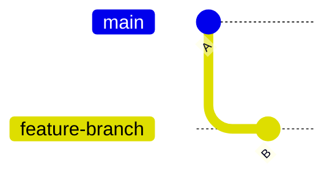
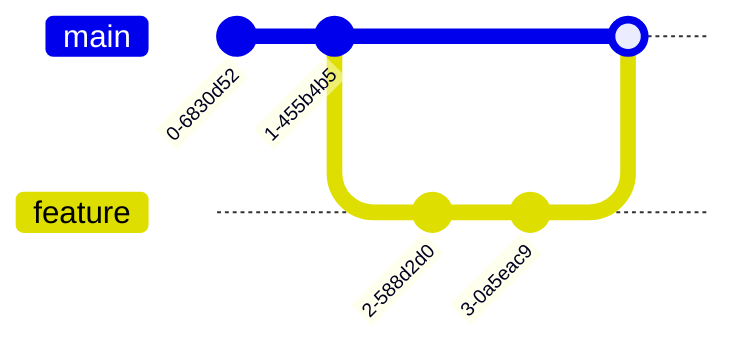
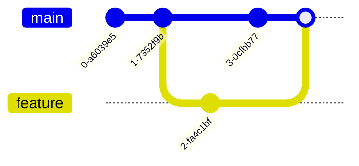
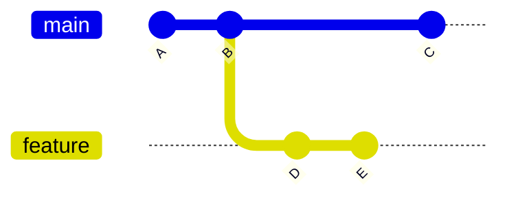
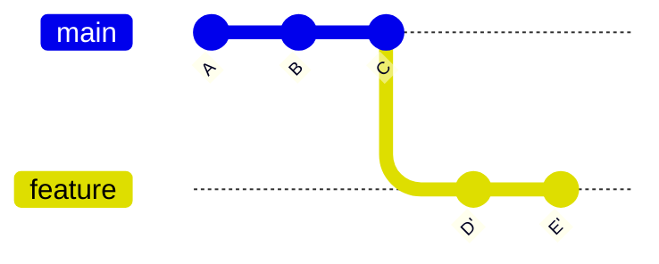
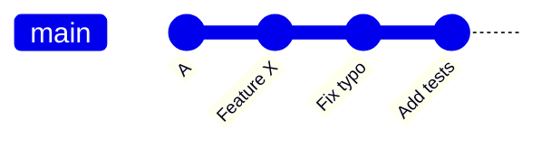
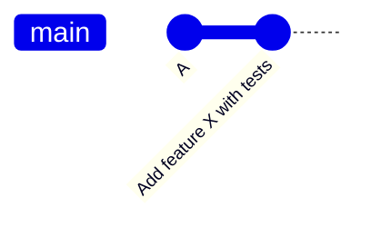
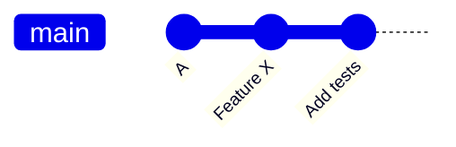

# Git in Practice

## Introduction / Setup

Now that you've learned about how Git actually works under the hood, we can start learning about how to use Git. There are a variety of interfaces avaliable to interact with Git, like the command line, various GUIs, tools like GitHub, and more. In this lesson, we'll focus on the command line version. If you don't have Git installed on your machine, install it using the instructions [here](https://git-scm.com/book/en/v2/Getting-Started-Installing-Git). You may also need to complete some some [first time setup](https://git-scm.com/book/en/v2/Getting-Started-First-Time-Git-Setup) which we will not be covering here.

Note that a lot of this content is referenced from the [Pro Git book](https://git-scm.com/book/en/v2), with the respective liscense found [here](https://creativecommons.org/licenses/by-nc-sa/3.0/). I've also heavily referenced the excellent [Beej's Guide To Git](https://beej.us/guide/bggit/) for structure and examples.

### Getting Started with Repositories

The first thing you'll need to do when working with Git is to get your Git repository. This is done either by taking a local directory and converting it into a Git repository or by cloning an existing Git repository from somehwere like GitHub.

#### Initializing A Local Repository Using `git init`

To create a new Git repository, navigate to your desired directory and run:

```bash
git init
```

This creates a `.git` subdirectory that stores all version control data, including objects, references, and the commit history.

#### Cloning an Existing Repository

To copy an existing repository from services like GitHub or GitLab, use:

```bash
git clone <url>
```

This command will first create a new directory named after the project. Next, it will download the complete repository history, including all commits and branches. Sets up the working directory with files from the default branch (ex. main / master).

Git supports both HTTPS and SSH protocols for cloning, which you can choose based on your authentication requirements. While cloning is typically done once at the start of working with a repository, you can also clone specific branches if needed.

## Basic Git Workflow

The basic workflow follows five simple steps that you'll repeat each time you want to make and save changes. Note that this ties back to the concepts we talked about in the Git Theory section.

First, you'll work on your files locally, making whatever changes you need to your code or documents. Think of this as your normal editing process. This is also known as making changes in your working directory.

Next, you'll tell Git which changes you want to include in your next snapshot using the "staging" process. This gives you control over exactly which modifications will be saved. This is called staging your changes.

Third, you'll create a "commit", which is taking a snapshot of your staged changes, along with a message describing what you changed and why.

Fourth, you'll send your committed changes to GitHub (or another remote repository). This is called "pushing" your changes.

You can then repeat this changes as time progresses. Note that this isn't the *only* workflow that is used, just a very common one.

We've covered the theoretical idea behind all of these concepts previously, but now we'll talk about the commands for these operations.

## Core Git Operations

Now that we have a repository, we'll walk through the workflow and the associated command one by one. For this section, we'll be starting with an empty directory and run `git init` to initialize our repository.

### Making Changes

Before we make any changes, we can ask Git what the current status of the local repository is by using the `git status` command.

```bash
❯ git status
On branch main

No commits yet

nothing to commit (create/copy files and use "git add" to track)
```

This tells us that we are currently on the `main` branch. Recall from the previous lesson that branches are a reference to a specific commit and allow for parallel tracks of development. It also tells us that we haven't made any commits yet and that there aren't any changes to commit.

Let's start by creating a file called `hello.py`, with the contents of:

```python
print("Hello, world!")
print("Welcome to CMSC398W!")
```

Once we save the file and run `git status` again, we see that:

```bash
❯ git status
On branch main

No commits yet

Untracked files:
  (use "git add <file>..." to include in what will be committed)
        hello.py

nothing added to commit but untracked files present (use "git add" to track)
```

This tells us that Git has detected that we have created a file named hello.py that is not currently *tracked* by Git. Recall that files in Git can be either untracked or tracked, where untracked means that it hasn't added to version control, while tracked has. It also says that there is "nothing added to commit but untracked files present", which means that we haven't *added* any of our modified files to the *staging area* so we can *commit* them. Hopefully its started to get clearer why understanding the various terminologies and data models is useful when using Git. So, let's do exactly that and add our changes to the staging area.

#### Staging (git add)

We can use the `git add` command to stage changes to prepare to commit. We can either stage all of the changes in your directory, or stage specific files. Let's look at an example:

```bash
❯ git add hello.py
❯ git status
On branch main

No commits yet

Changes to be committed:
  (use "git rm --cached <file>..." to unstage)
        new file:   hello.py
```

This has changed the message from "Untracked files" to now tell us that what changes are currently ready to be committed, namely, the new file hello.py. If we accidentally staged the file and want to unstage it, a helpful message is included as well.

#### Committing (git commit)

Now that our changes have been added to the staging area, we can commit them. Only files that are added to the staging area will be committed, so if I change a file but don't call either `git add .` (stage all the changes in the current directory) or `git add <filename>`, that change won't be committed. With each commit, you include a message that describes what a change in, why it was made, and other information.

```bash
❯ git commit -m "added hello.py for testing"
[main (root-commit) 34903ef] added hello.py for testing
 1 file changed, 2 insertions(+)
 create mode 100644 hello.py
```

This tells us that we have committed to the main *branch* with the message of "added hello.py for testing". In this commit, we've changed 1 file and inserted two lines. It also says we've created file hello.py (mode 100644 just indicates the file permissions, but generally is not something you need to worry about).

#### Pushing (git push)

If we cloned our repository from a pre-existing remote repository, we could then push our changes. Since we created this repository locally, we don't have a remote to push to, but we'll work more with remotes and how to use them in a later section.

### Viewing History (git log)

Now that we've added our changes and committed them, we can see all of our commits within a log, accessible (unsurprisingly) via `git log`.

```bash
❯ git log

commit 34903ef910501690b5c619da5378c2d4b3fd82dc (HEAD -> main)
Author: John Doe <johndoe@gmail.com>
Date:   Tue Mar 4 22:40:00 2025 -0500

    added hello.py for testing
```

This gives us the SHA-1 hash for the commit Recall that everything in Git is generally addressed by it's SHA-1 hash, which makes it easy to identify a particular commit if you needed to go back in history. This commit is also at the "tip" of the `main` branch. It tells us who made the commit, the time it was made, and the commit message. If we add another commit, the log grows like a stack.

```bash
❯ git log

commit 0b142e96b92f9f07c54ecc3f4c22a068f0eac8ea (HEAD -> main)
Author: John Doe <johndoe@gmail.com>
Date:   Tue Mar 4 22:51:59 2025 -0500

    added goodbye

commit 34903ef910501690b5c619da5378c2d4b3fd82dc
Author: John Doe <johndoe@gmail.com>
Date:   Tue Mar 4 22:40:00 2025 -0500

    added hello.py for testing
```

### Understanding HEAD

In our previous log outputs, you might have noticed the term `HEAD` appearing. HEAD is Git's way of tracking "where you are right now" in the repository's history. Most of the time, HEAD points to the name of the current branch (in our case, `main`), which in turn points to the latest commit on that branch.

Let's look at our current situation:

```bash
❯ git log
commit 0b142e96b92f9f07c54ecc3f4c22a068f0eac8ea (HEAD -> main)
Author: John Doe <johndoe@gmail.com>
Date:   Tue Mar 4 22:51:59 2025 -0500

    added goodbye

commit 34903ef910501690b5c619da5378c2d4b3fd82dc
Author: John Doe <johndoe@gmail.com>
Date:   Tue Mar 4 22:40:00 2025 -0500

    added hello.py for testing
```

Here, `(HEAD -> main)` tells us that HEAD is pointing to the `main` branch, which is at commit `0b142e9`. When working with branches, we use the modern `git switch` command to move between them:

```bash
❯ git switch main     # Switch to main branch
```

We can also look at previous commits directly, which creates a "detached HEAD" state:

```bash
❯ git checkout 34903ef
Note: switching to '34903ef'.

You are in 'detached HEAD' state...
```

This brings us to an important concept: the "detached HEAD" state. A detached HEAD occurs when you point HEAD directly to a commit instead of a branch.

Normal HEAD:

```bash
HEAD -> main -> commit 0b142e9
```

Detached HEAD:

```bash
main -> commit 0b142e9
HEAD -> commit 34903ef
```

While in a detached HEAD state, you can look at files as they were at that commit, make experimental changes, and create new commits. However, since HEAD isn't attached to a branch, any new commits you make will be "floating" and could be lost when you switch to a different commit. If you want to keep changes made in a detached HEAD state, you should create a new branch:

```bash
❯ git switch -c old-version   # Create and switch to new branch
```

We'll talk more about branches in the next section.

To get back to your latest work, you can always return to your main branch:

```bash
❯ git switch main
```

This will reattach HEAD to the main branch and bring you back to your most recent commit.

## Branching and Merging

Branching is one of Git's most powerful features, allowing developers to work on multiple versions of their code simultaneously. Building on our understanding of Git's data model, we know that branches are just pointers to specific commits in the repository's history.

### Creating and Managing Branches

There are two main commands for working with branches:

- `git branch`: Lists, creates, or deletes branches
- `git switch`: Moves between branches (or creates and switches with `-c`)

To create a new branch:

```bash
git switch -c feature-branch  # Create and switch to new branch
# or
git branch feature-branch     # Create branch only
git switch feature-branch     # Switch to branch
```

To list all branches:

```bash
git branch  # The current branch is marked with an asterisk (*)
```

To delete a branch:

```bash
git branch -d feature-branch  # Safe delete (prevents deletion of unmerged changes)
git branch -D feature-branch  # Force delete (use with caution)
```

### Understanding Branch Operations

When you create a branch, Git simply creates a new pointer to the current commit. Once you switch / checkout to the new branch, the HEAD reference is updated to point to your new branch, indicating which branch you're currently working on.

For example, if you're on the main branch and create a new feature branch:

1. Initially:

   ```bash
   main    → commit A
   HEAD    → main
   ```

2. After creating and switching to feature-branch:

   ```bash
   main           → commit A
   feature-branch → commit A
   HEAD          → feature-branch
   ```

3. After making a new commit on feature-branch:

   ```bash
   main           → commit X
   feature-branch → commit B
   HEAD          → feature-branch
   ```



## Merging Branches

Git provides several strategies for combining work from different branches. Understanding these strategies is crucial for maintaining a clean and manageable repository history. Types of merges include:

1. **Fast-Forward Merge**
   - Occurs when there are no new commits on the target branch
   - Simply moves the branch pointer forward
   - Creates a linear history
   - No merge commit is created



This diagram shows a fast-forward merge scenario. Notice how all commits in the feature branch are direct descendants of the main branch's last commit. When merged, the main branch pointer simply moves forward to the latest feature branch commit, creating a straight line of history without any merge commits.

2. **Three-Way Merge (Recursive)**
   - Used when branches have diverged
   - Creates a new merge commit
   - Preserves complete history of both branches
   - May require conflict resolution



This diagram demonstrates a three-way merge. The branches have diverged as both main and feature branches have received unique commits. The merge creates a new commit (shown as the merge node) that combines both histories. This preserves the complete development history of both branches and shows exactly where they were integrated.

There are additional merge strategies avaliable, but we will focus on these two.

### Performing A Merge

To perform a merge:

```bash
git switch main          # Switch to the target branch
git merge feature-branch # Merge changes from feature-branch
```

During a merge:

1. Git checks if a fast-forward is possible
2. If yes, it simply moves the target branch pointer forward to match the source branch
3. No new commit is created

If it's not possible, we will do a three way merge. If there are no conflicts, this will happen cleanly, but there may be conflicts that create things called merge conflicts.

### Creating and Resolving Merge Conflicts

When Git can't automatically merge changes, it creates a merge conflict. This typically happens when one of the following things has happened.

- The same file was modified in different ways on both branches
- A file was modified on one branch and deleted on another
- A file was added with the same name but different content on both branches

When a conflict occurs, Git will mark the conflicting sections in the affected files and pause the merge process. You have to then manually resulve the conflicts (if using VSCode with the Git extension, you can use the lovely merge editor), and then can finally create a merge commit.

Example of a conflict marker:

```bash
<<<<<<< HEAD
Your changes on the current branch
=======
Changes from the branch being merged
>>>>>>> feature-branch
```

To resolve a conflict, follow these steps:

1. Open the conflicting files
2. Choose which changes to keep (or combine them)
3. Remove the conflict markers
4. Stage the resolved files (`git add`)
5. Complete the merge (`git commit`)

## Working with Remotes

A remote in Git is simply a name for a remote server that hosts a Git repository. While you could refer to remotes using their full URLs (like https://github.com/chrislgarry/Apollo-11/tree/master), Git provides a more convenient way to reference them using nicknames. The most common remote name is `origin`, which is automatically set when you clone a repository.

Git uses slash notation to refer to branches on remotes. For example, `origin/main` refers to the main branch on the remote named origin.

### Viewing and Managing Remotes

To list your current remotes, use the `git remote -v` command:

```bash
❯ git remote -v
origin  git@github.com:mdurrani808/STIC.git (fetch)
origin  git@github.com:mdurrani808/STIC.git (push)
```

This output shows that we have a remote named `origin` that we can both fetch from and push to. While the fetch and push URLs are often the same, they can be different if needed.

### Adding New Remotes

Let's work through a common scenario: adding the original repository as a remote after forking a project. We'll use the Linux kernel as an example (this example was taken from Beej's guide, as detailed above).

When you fork a repository on GitHub, you create your own copy that you can modify. Initially, your fork will have one remote:

```bash
origin    git@github.com:mdurrani808/linux.git (fetch)
origin    git@github.com:mdurrani808/linux.git (push)
```

To keep your fork up-to-date with Linus Torvalds' original repository, you'll want to add it as a second remote:

```bash
❯ git remote add reallinux https://github.com/torvalds/linux.git
```

Now your remotes list will show both repositories:

```bash
origin    git@github.com:mdurrani808/linux.git (fetch)
origin    git@github.com:mdurrani808/linux.git (push)
reallinux    https://github.com/torvalds/linux.git (fetch)
reallinux    https://github.com/torvalds/linux.git (push)
```

### Syncing with Remotes

To get changes from a remote repository:

1. Fetch the changes:

```bash
❯ git fetch reallinux
```

2. Merge them into your local branch:

```bash
❯ git switch master          # switch to your local branch
❯ git merge reallinux/master # merge the remote changes
```

When you make local commits, they'll advance your local HEAD and branch pointer while leaving the remote references (like `origin/master` and `reallinux/master`) behind. For example, after making two local commits, your log might look like this:

```bash
commit 2d7d5d (HEAD -> master)
commit cde831
commit 311eb3 (origin/master)
commit d5d2cc (reallinux/master)
```

To send your changes back to GitHub, use `git push`. After pushing, the remote reference will update:

```bash
commit 2d7d5d (HEAD -> master, origin/master)
commit cde831
commit 311eb3
commit d5d2cc (reallinux/master)
```

This workflow allows you to maintain your own version of the code while still being able to incorporate updates from the original repository.

### Remote Tracking Branches

When you clone a repository, Git creates something called "remote-tracking branches". These are local references that represent the state of branches on your remote repositories. For example, when you clone a repository, you'll have:

```bash
main            # Your local main branch
origin/main     # Remote-tracking branch for main on origin
```

While this might look like just two branches, there are actually three branches involved:

1. Your local `main` branch
2. The remote-tracking branch `origin/main` on your computer
3. The actual `main` branch on the remote repository

The remote-tracking branch (`origin/main`) is your local copy of the remote branch's state. Git automatically updates it when you interact with the remote (through push, fetch, or pull operations).

#### Viewing Remote Tracking Branches

To see all your branches, including remote-tracking branches, use:

```bash
❯ git branch -avv
* main                  2d63af5 [origin/main] Latest commit message
  feature-branch        cdac325 [origin/feature] Feature work
  remotes/origin/HEAD   -> origin/main
  remotes/origin/main   2d63af5 Latest commit message
  remotes/origin/feature cdac325 Feature work
```

This shows your local branches (`main` and `feature-branch`), which remote branch they're tracking (shown in brackets), and the remote-tracking branches under `remotes/origin/`.

#### Setting Up Branch Tracking

When you want to push a local branch to a remote for the first time, you need to set up tracking:

```bash
git push --set-upstream origin feature-branch
# or the shorter version
git push -u origin feature-branch
```

This pushes your local branch to the remote and sets up tracking so future pushes and pulls know where to go. After setting up tracking, you can simply use:

```bash
git push
git pull
```

#### Pushing New Branches

When you create a new local branch and try to push it, you'll need to tell Git where to push it:

```bash
❯ git switch -c new-feature
❯ git push
fatal: The current branch new-feature has no upstream branch.
To push the current branch and set the remote as upstream, use:
    git push --set-upstream origin new-feature
```

Simply follow Git's suggestion to set up the tracking:

```bash
❯ git push --set-upstream origin new-feature
```

#### Managing Multiple Remotes

It's common to work with multiple remotes, especially when working with forked repositories. For example, you might have:

- `origin`: Your fork of the repository
- `upstream`: The original repository you forked from

To work with branches from different remotes:

1. Fetch changes from a remote:

```bash
❯ git fetch upstream
```

2. Create a local branch based on the remote branch:

```bash
❯ git switch -c feature upstream/feature
```

3. Push to your own remote:

```bash
❯ git push -u origin feature
```

#### Cleaning Up Remote Branches

To clean up remote-tracking branches that no longer exist on the remote:

```bash
❯ git fetch --prune        # Prune a specific remote
❯ git fetch --prune --all  # Prune all remotes
```

To delete a branch on the remote:

```bash
❯ git push origin --delete feature-branch
```

## Common Git Tasks

### Comparing Changes (git diff)

The `git diff` command allows you to see the differences between any two states in your repository. Without any arguments, it shows unstaged changes in your working directory:

```bash
❯ git diff
diff --git a/hello.py b/hello.py
index e4445b1..f022404 100644
--- a/hello.py
+++ b/hello.py
@@ -1,2 +1,3 @@
 print("Hello, world!")
 print("Welcome to CMSC398W!")
+print("Changes not yet staged")
```

This output tells us several things:

- The file being changed is `hello.py`
- The lines starting with `-` show content being removed (none in this case)
- The lines starting with `+` show new content being added
- The `@@ -1,2 +1,3 @@` indicates that we're seeing lines 1-2 in the old file and lines 1-3 in the new file
- The unchanged context lines are shown without any prefix

To see staged changes that will be included in your next commit:

```bash
❯ git diff --staged
diff --git a/hello.py b/hello.py
index f022404..3d4c568 100644
--- a/hello.py
+++ b/hello.py
@@ -1,3 +1,4 @@
 print("Hello, world!")
 print("Welcome to CMSC398W!")
 print("Changes not yet staged")
+print("This change is staged")
```

The format is the same as before, showing us exactly what changes are staged for commit.

You can also compare branches or specific commits:

```bash
❯ git diff main feature-branch        # Compare two branches
❯ git diff HEAD~1 HEAD               # Compare with previous commit
❯ git diff 1a2b3c 4d5e6f            # Compare specific commits
```

### File Operations

Git provides several commands for managing files in your repository. While you can use regular shell commands (mv, rm), using Git's commands ensures proper tracking of these operations.

#### Renaming Files

To rename a file in Git:

```bash
❯ git mv old-name.txt new-name.txt
❯ git status
On branch main
Changes to be committed:
  (use "git restore --staged <file>..." to unstage)
        renamed:    old-name.txt -> new-name.txt
```

The status output confirms that Git has recognized this as a rename operation rather than a separate delete and add. It also provides a helpful hint about how to unstage the change if needed.

This is equivalent to:

```bash
❯ mv old-name.txt new-name.txt
❯ git rm old-name.txt
❯ git add new-name.txt
```

#### Removing Files

To remove files from both your working directory and Git's tracking:

```bash
❯ git rm filename.txt
❯ git status
On branch main
Changes to be committed:
  (use "git restore --staged <file>..." to unstage)
        deleted:    filename.txt
```

The status output shows that the file is staged for deletion in the next commit.

To stop tracking a file but keep it in your working directory:

```bash
❯ git rm --cached filename.txt
❯ git status
On branch main
Changes to be committed:
  (use "git restore --staged <file>..." to unstage)
        deleted:    filename.txt

Untracked files:
  (use "git add <file>..." to include in what will be committed)
        filename.txt
```

Notice how the status now shows the file as both deleted (from Git's tracking) and untracked (still present in the working directory). This is particularly useful for files that were accidentally committed but should be ignored (like configuration files or build artifacts).

### Stashing Changes

Git stash is a powerful feature that allows you to temporarily store modified tracked files when you need to switch contexts but aren't ready to commit.

Basic stash operations:

```bash
❯ git stash                 # Save current changes to stash
Saved working directory and index state WIP on main: 1234abc initial commit
```

This output confirms that your changes have been saved and indicates which branch and commit they were based on.

```bash
❯ git stash list           # View all stashed changes
stash@{0}: WIP on main: 1234abc initial commit
stash@{1}: On feature-branch: Experimental changes
```

The list shows all stashes, with the most recent at the top (stash@{0}). Each entry shows the branch name and commit message where the stash was created.

```bash
❯ git stash show stash@{0}  # Show contents of specific stash
 hello.py | 2 +-
 1 file changed, 1 insertion(+), 1 deletion(-)
```

This output summarizes what changes are in the stash, similar to what you'd see in a commit message.

```bash
❯ git stash pop           # Apply and remove most recent stash
On branch main
Changes not staged for commit:
  (use "git add <file>..." to update what will be committed)
  (use "git restore <file>..." to discard changes in working directory)
        modified:   hello.py

Dropped refs/stash@{0} (1234abc5678def)
```

The output shows that the stashed changes have been reapplied to your working directory and the stash entry has been removed.

### Amending Commits

Sometimes you need to modify your most recent commit, we can use the the `--amend` flag for this.

```bash
❯ git commit --amend              # Update last commit message
[main 1234abc] Updated commit message
 Date: Wed Mar 5 10:00:00 2025 -0500
 1 file changed, 1 insertion(+)
```

The output shows the new commit hash and confirms that the commit was updated.

```bash
❯ git add forgotten-file.txt
❯ git commit --amend --no-edit
[main 5678def] Original commit message
 Date: Wed Mar 5 10:00:00 2025 -0500
 2 files changed, 1 insertion(+)
 create mode 100644 forgotten-file.txt
```

The output shows that the commit was updated to include the new file while keeping the original commit message. Notice that the commit hash has changed (from 1234abc to 5678def), which is why you should only amend commits that haven't been pushed to a shared repository.

## Advanced Git Operations

### Rebasing

Rebasing is a Git operation that allows you to modify your commit history by moving a sequence of commits to a new base commit. While merging creates a new commit that combines changes from two branches, rebasing rewrites history by creating new commits that replicate your changes on top of a different starting point.

Let's say you have a feature branch that branched off from main some time ago. Here's the initial state:



If you want to include the latest changes from main (commit C) into your feature branch, you could merge main into feature, or you could rebase feature onto main. Here's how to rebase:

```bash
git switch feature     # First, switch to the branch you want to rebase
git rebase main       # Then rebase onto the target branch
```

This will:

1. Temporarily save your feature branch commits (D, E)
2. Move to the latest commit on main (C)
3. Replay your commits one by one on top of C

After the rebase, your history will look like this:



Note that D' and E' are new commits that contain the same changes as D and E, but have different commit hashes because they now have a different parent commit.

#### Handling Conflicts During Rebase

Sometimes when rebasing, Git can't automatically apply your changes because they conflict with changes in the base branch. When this happens, Git will pause the rebase and let you fix the conflicts:

```bash
git rebase main
# Git encounters a conflict
CONFLICT (content): Merge conflict in file.txt
Auto-merging file.txt
Failed to merge in the changes.
```

To resolve conflicts during a rebase:

1. Open the conflicting files and resolve the conflicts
2. Add the resolved files: `git add <filename>`
3. Continue the rebase: `git rebase --continue`

At any point, you can:

- Continue the rebase: `git rebase --continue`
- Skip the current commit: `git rebase --skip`
- Abort the rebase entirely: `git rebase --abort`

#### Interactive Rebasing

Interactive rebasing is a powerful feature that lets you modify commits as they're being replayed. You start an interactive rebase by specifying how many commits back you want to modify:

```bash
git rebase -i HEAD~3    # Modify the last 3 commits
```

This opens your text editor with a list of commits and possible actions:

```bash
pick abc123 Add feature X
pick def456 Fix typo
pick ghi789 Add tests

# Commands:
# pick = keep this commit as is
# reword = keep the changes, but edit the commit message
# edit = pause to amend this commit
# squash = combine this commit with the previous commit
# fixup = combine this commit with the previous commit, discard this message
# drop = remove this commit
```

Common interactive rebase operations:

##### Changing a Commit Message

Change `pick` to `reword`:

```bash
reword abc123 Add feature X
pick def456 Fix typo
pick ghi789 Add tests
```

Save and close. Git will prompt you to edit each commit message you marked for rewording.

##### Combining Multiple Commits

To combine commits, change `pick` to `squash` or `fixup`:

```bash
pick abc123 Add feature X
squash def456 Fix typo
squash ghi789 Add tests
```

- `squash` lets you edit the combined commit message
- `fixup` discards the commit messages of the commits being combined

Before squashing:



After squashing:



##### Removing a Commit

Change `pick` to `drop` (or just delete the line):

```bash
pick abc123 Add feature X
drop def456 Fix typo
pick ghi789 Add tests
```

Before dropping:


After dropping the middle commit:



#### When to Use Rebase

Rebase is best used for:

- Cleaning up your local commit history before sharing
- Incorporating latest changes from main into your feature branch
- Maintaining a linear project history

Avoid rebasing commits that you've already pushed to a shared repository, as this rewrites history and can cause problems for other developers.
