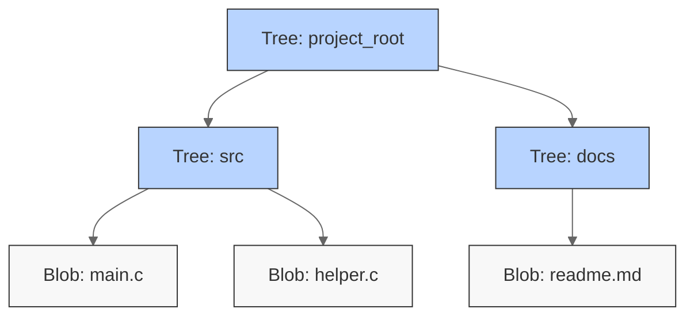
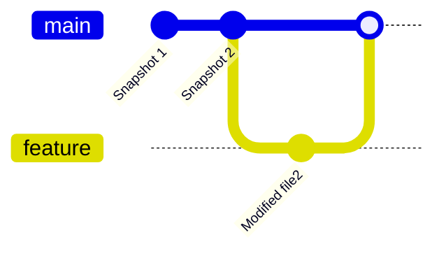
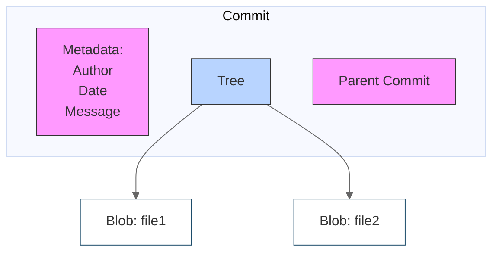
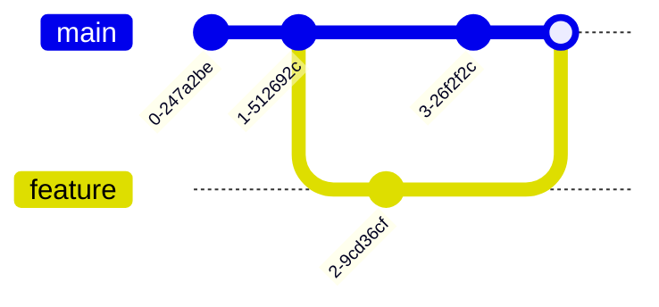
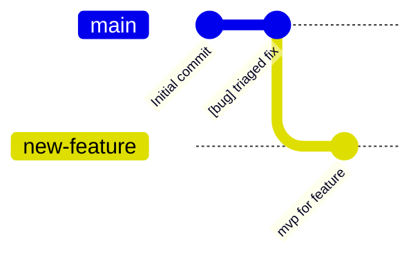
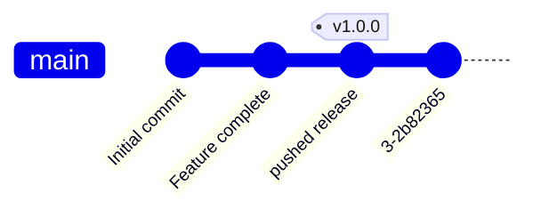
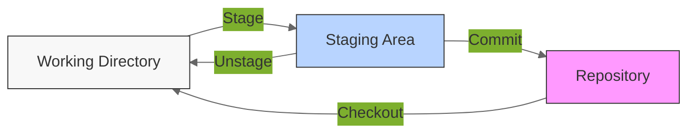
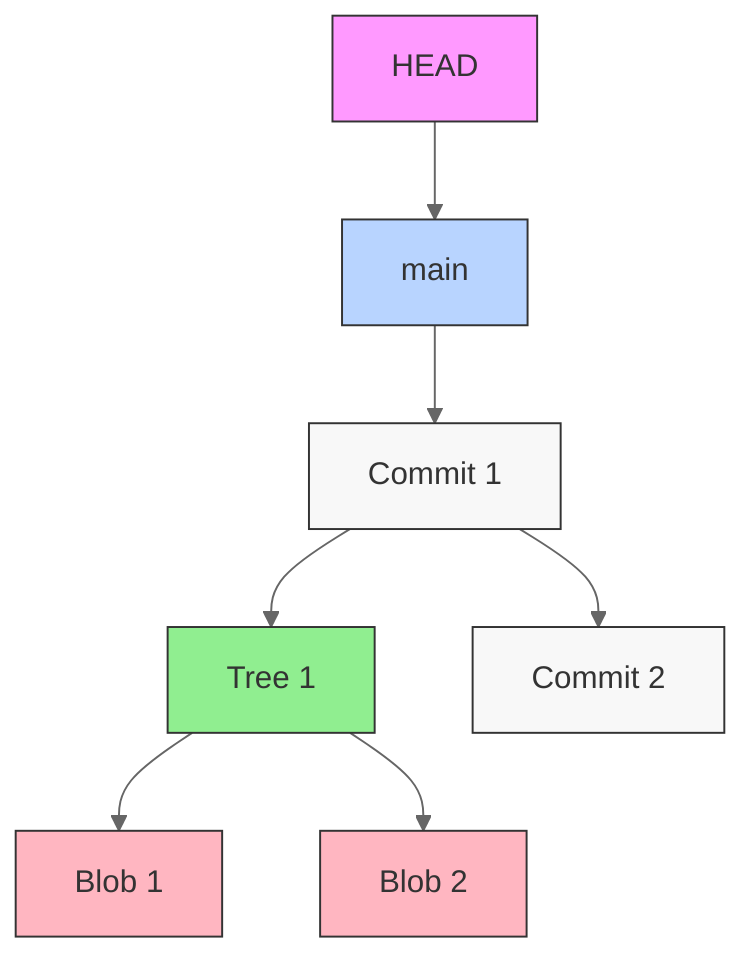

# Git and Version Control

## Introduction

Version control systems (VCS) are fundamental tools in modern software development, and Git has emerged as the de facto standard. However, many developers learn Git through memorizing commands without understanding its elegant underlying design. This approach often leads to confusion when things go wrong, as developers lack the theoretical foundation to reason about Git's behavior.

This text takes a different approach. Instead of starting with commands, we'll build understanding from the ground up by exploring Git's data model and theoretical foundations. When you understand these fundamentals, you'll be able to reason about Git's behavior rather than memorizing commands, solve complex version control problems with confidence, and develop mental models that translate across different Git workflows.

## Git's Object Model

Git is a content-addressable filesystem built on a simple data model. Understanding this model is important because everything else in Git is built upon it.

### Blobs

The most basic unit in Git's data model is the blob (binary large object). A blob represents the contents of a file, stripped of all metadata. When you add a file to Git, its contents are stored as a blob, identified by a SHA-1 hash of its content. What makes blobs special is their content-addressed nature. The same file content always produces the same blob hash, regardless of where it appears in your project or what you name the file. This property enables powerful deduplication:i f you have the same file content in multiple places in your project, Git only stores it once. Furthermore, blobs are immutable—once created, they never change. If you modify a file, Git creates a new blob, leaving the original untouched.

### Trees

While blobs store content, they don't maintain structure or any metadata. Git uses trees to organize blobs into directories and provide metadata like file names and permissions. A tree object is basically a snapshot of a directory structure, mapping names to blobs (for files) or other trees (for subdirectories).



Consider a typical project structure. A tree object might contain entries like:

```bash
100644 blob 5e1c309... hello.txt
100644 blob f2d7164... world.txt
040000 tree a23b9f3... docs
```

Each entry in a tree includes the mode (file permissions), type (blob or tree), hash, and name. This separation of content (in blobs) from metadata (in trees) is a key design decision that enables Git's efficient storage and flexible branching model.

### Snapshots

Unlike other version control systems that store differences between versions, Git stores snapshots—complete pictures of your project at specific points in time. Each snapshot is represented by a tree that points to all the project's content at that moment.



## History

### Commits

While snapshots capture the state of your project, Git needs a way to track how these states evolve over time. This is what a commit is, a snapshot with some additional context. Each commit contains a pointer to its parent commit(s), metadata about who made the change and why (commit message), and a pointer to the tree representing the project's state.



What makes commits special is their immutability. Once created, a commit can (almost) never be changed. This immutability is enforced through Git's content-addressing system: each commit is identified by a hash of its contents, including the parent commit hash. This means that changing any aspect of a commit would result in a different hash.

### The Commit Graph

As you make commits, Git builds a directed acyclic graph (DAG) of your project's history. Each commit points to its parent commit(s), creating a chain of history that can be traversed.



This graph structure is what enables Git's powerful branching and merging capabilities.

## References

### Understanding References

References are named pointers to commits. While the commit graph captures the complete history of your project, references provide meaningful entry points into that history. This seperates the logical organization of your project's history from its physical implementation and lets you work with meaningful names instead of commit identifiers.

### Types of References

#### Direct References

Direct references point straight to commits, creating a direct naming relationship and come in two types, branches and tags.

Branches are mutable direct references that move as new commits are created to a branch.



Tags are immutable direct references that permanently mark specific points in history.



#### Symbolic References

Symbolic references point to other references rather than directly to commits. The most important symbolic reference is HEAD, which represents your current position in the history. Think of HEAD as your "you are here" marker in the commit graph. Unlike direct references that always point to specific commits, symbolic references can track moving targets, automatically updating as referenced move.

## Staging Area / Index

Git's three-state model provides a structured approach to creating repository history.

### The Three-State Model

Each file in a Git repository exists in one or more of three distinct states, working directory, staging, or repository.

#### Working Directory

The working directory represents the current state of your project's files. It's where you modify files, create new ones, and delete others. The working directory tracks actual file content without version control metadata. Files here may be tracked (known to Git) or untracked (ignored by Git).

#### Staging Area

The staging area acts as a pre-commit workspace where changes are organized before becoming part of repository history. It contains a precise record of what will be included in the next commit. The staging area enables fine-grained control over how changes become part of project history by allowing selective inclusion of modifications.

#### Repository

The repository stores the complete version history as a graph of commits. Each commit represents a snapshot of the project at a specific point in time, including all tracked files. The repository maintains this history in an immutable form, ensuring integrity.

### Purpose of the Staging Area

The staging area serves as an intermediate state between the working directory and repository.

1. Pre-commit organization of changes, allowing developers to create focused commits that represent logical units of work
2. Separation between works in progress and changes ready for commit
3. Review of pending changes before they become part of repository history

The staging area acts as a gateway for commits. Only changes that have been staged can become part of repository history, ensuring that commits represent intentional groupings of modifications.



## Git's Complete Model

Git's data model unifies several key concepts:

1. **Snapshots and the Object Model**
   - Commits point to trees representing complete project states
   - Trees organize blobs containing file content
   - All objects are content-addressed, ensuring data integrity

2. **The Commit Graph**
   - Commits form a directed acyclic graph (DAG)
   - Each commit points to its parent(s)
   - The graph structure enables history tracking and parallel development

3. **References and History Access**
   - References provide named entry points into the commit graph
   - Branches track ongoing development
   - Tags mark significant points in history
   - HEAD tracks the current state


