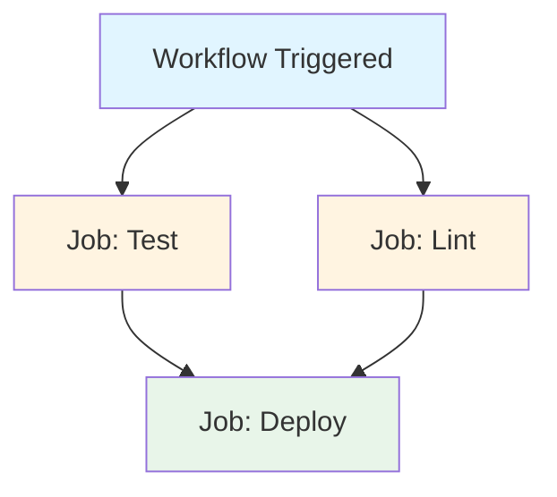
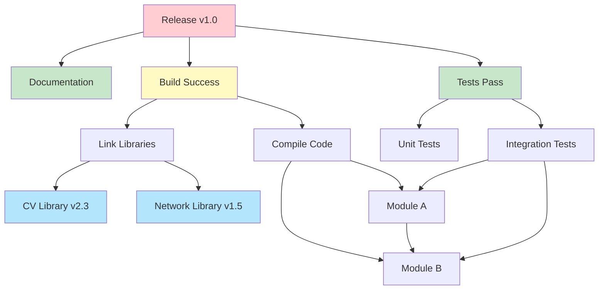
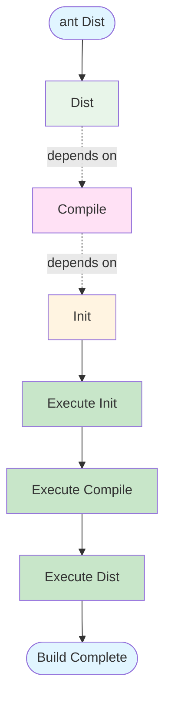
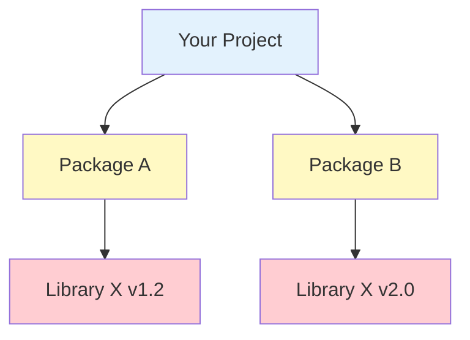
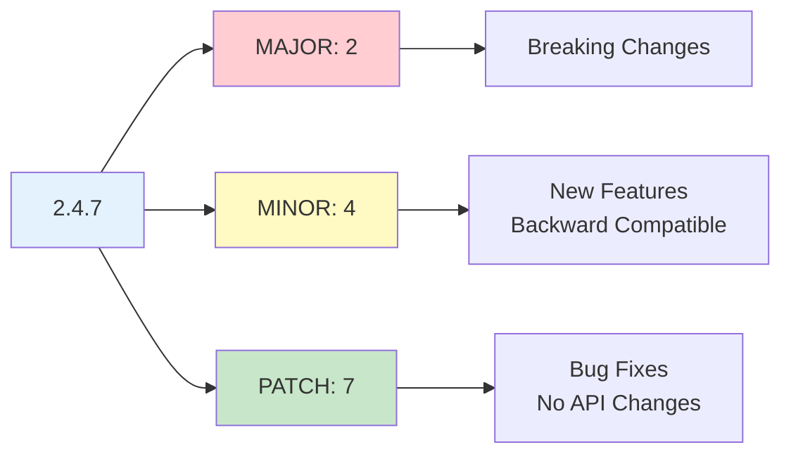

# CMSC398W

# Build Systems

<!--
Title rearrangment
-->

---
layout: default
---

# Overview and Announcements

**Overview**

- Continuous Integration + Advanced Git
- Build Systems
- Dependency Management

<!--
Talk about the PacMan project and if you have any questions etc.

Overview of the lesson today
-->

---
layout: default
---

# Continuous Integration (CI)

- CI is the practice of frequently integrating code changes into a shared repository
- Developers regularly push their code changes (e.g., daily or multiple times a day), and these changes are automatically built and tested
- Goal: Catch issues early, ensuring the codebase is always in a deployable state

**Workflow**

1. Code Commit
2. Build
3. Test
4. Notify

<!--
Continuous Integration (CI) is a practice where developers regularly integrate their code changes into a shared repository. This practice encourages developers to commit their code frequently, often multiple times a day or at least daily. By pushing code changes often, teams can detect problems early and maintain a codebase that is always ready for deployment. The focus is on early issue detection and ensuring that the code is in a deployable state at all times.

The workflow begins with the Code Commit step, where developers submit their changes to the shared repository. This is typically done multiple times a day, helping to reduce the complexity of integrating larger changes down the line.

Next is the Build step, where the committed code is automatically compiled and built by a system. This ensures that the new changes don't break any existing code and that the application remains in a functioning state.

Following the build, the code undergoes the Test phase. Automated tests are run to validate that the changes behave as expected and haven't introduced bugs. This is crucial in ensuring the integrity and reliability of the application.

Lastly, after the tests have been executed, the system sends out a Notification to inform developers of the status. If the build passes successfully and all tests are green, developers know that their changes are safe to deploy. If there are failures, the developers are notified immediately, so they can address the issues before they escalate.

In summary, CI enables teams to maintain a stable and deployable codebase by integrating code regularly, building, testing, and quickly notifying developers of any issues.
-->

---
layout: default
---

# What are GitHub Actions

- GitHub Actions automates workflows in your GitHub repository
- Workflows are defined in YAML files (`.github/workflows/`)
- Workflows are triggered by GitHub events (pushes, PRs, releases, etc.)
- Workflows contain jobs that run tasks (e.g., build, test, deploy) on different operating systems (Ubuntu, macOS, Windows)
- Each job in a workflow contains steps, which are either commands or reusable actions

<!--
GitHub Actions is a powerful automation tool that allows you to define and manage workflows directly within your GitHub repository. With GitHub Actions, you can automate a variety of tasks, such as building, testing, and deploying code, whenever specific events occur in your repository. This automation helps streamline processes and ensures consistency across your projects.

Workflows in GitHub Actions are defined using YAML files, which are stored in the .github/workflows/ directory within your repository. These files specify the steps and actions that should be taken whenever a particular event occurs, such as a code push, a pull request, or a new release. The flexibility of YAML allows you to clearly outline your automation processes and control their execution.

Workflows are triggered by GitHub events. These events could be anything from a simple push to a branch, to the creation of a pull request (PR), or the release of a new version. GitHub Actions listens for these events and runs the appropriate workflows whenever they are triggered, enabling a responsive and automated system for continuous integration and delivery.

Within each workflow, you define jobs that represent a sequence of tasks. Each job runs a series of actions on one or more operating systems—Ubuntu, macOS, or Windows. This allows you to test and deploy across different environments without needing to manually manage each system.

Each job consists of steps, which are the individual tasks or actions that need to be performed. Steps can either be simple commands written directly in the workflow or reusable actions that have been created by the community or your team. Reusable actions are often packaged in a way that they can be shared across workflows, saving you time and effort in writing repetitive code.

In summary, GitHub Actions automates your workflows directly in GitHub by listening for events, running tasks across multiple environments, and allowing you to define and manage your CI/CD processes with flexibility and ease.
-->

---
layout: default
---

# Writing a CI Pipeline

**Name**

Specifies the name of the workflow. This is used for identification in the GitHub UI.

**On**

Specifies the events that trigger the workflow

**Common Events**

- Push
- pull_requests
- Workflow_dispatch
- schedule

<!--
In this section, we'll focus on the essential components of a CI pipeline. First, we have the Name field. This specifies the name of the workflow, and it's a critical piece of information for organizing and identifying workflows within the GitHub user interface (UI). When you have multiple workflows in a project, giving each workflow a distinct name makes it easier to track and understand the purpose of each workflow at a glance.

Next, we have the On field. This specifies the events that trigger the workflow to run. In GitHub Actions, workflows can be triggered by a variety of events such as pushing code, opening a pull request, manually triggering the workflow, or scheduling it to run at a specific time. Each of these events is an opportunity to define when and how the CI pipeline should be executed.

Let's dive deeper into some Common Events you can use:

Push – This event triggers the workflow when code is pushed to the repository. You can specify which branches or tags should trigger the pipeline. For example, you might want to run the pipeline on main or develop branches, but not on feature branches.

Pull Requests – This event triggers the workflow when a pull request is created or updated. It is helpful for running tests or linting when someone opens a pull request, ensuring that the code being proposed meets certain quality standards before merging.

Workflow Dispatch – This event allows you to manually trigger the workflow via the GitHub UI. It's useful for running the pipeline on-demand, especially in cases where you may not want to run it automatically on every push or pull request.

Schedule – This event triggers workflows at specific intervals, which is useful for tasks like running nightly tests or updating dependencies at regular intervals.

Understanding how to configure these events properly will help ensure your CI pipeline runs at the right times, maintaining an efficient development process and catching issues early in the lifecycle.
-->

---
layout: default
---

# Writing a CI Pipeline

## YAML Structure Example

```yaml
name: CI Pipeline

on:
  push:
    branches: [main, develop]
  pull_request:
    branches: [main]
  workflow_dispatch:
  schedule:
    - cron: '0 0 * * 0'  # Weekly on Sunday

jobs:
  build:
    runs-on: ubuntu-latest
    steps:
      - uses: actions/checkout@v3
      - name: Build project
        run: npm run build
```

---
layout: default
---

# Writing a CI Pipeline

**Jobs**

Defines the jobs to run in the workflow

Jobs are executed in parallel by default unless dependencies are set

**Types of jobs**

**runs-on**

Specifies the environment where the job will run

GitHub-hosted runners (Ubuntu, macOS, Windows) are common

**steps**

Each job consists of a list of steps that define the individual tasks

Steps can include running commands or using actions

<!--
A Job defines a set of tasks that will be executed as part of the workflow. Jobs are the building blocks of a workflow, and each one represents a unit of work that GitHub Actions will execute. These jobs are run independently by default, which means that unless specified otherwise, jobs will be executed in parallel. However, if a certain sequence of tasks is required, you can set dependencies between jobs to control the order of execution.

There are a few important aspects to consider when defining jobs, including the runs-on attribute, and steps within the job.

The runs-on field specifies the environment in which the job will run. This could be a specific operating system like Ubuntu, macOS, or Windows. GitHub Actions provides GitHub-hosted runners that come preconfigured with common environments like Ubuntu, macOS, and Windows. You can select the appropriate runner for your job depending on the platform your code needs to be tested or built on.

Each job is made up of a series of steps. Steps are the individual tasks that make up a job, and each step can either execute a specific command or use a predefined action. Actions are reusable units of work, such as setting up a Node.js environment or deploying to a cloud provider, and they help reduce the need to manually write custom code for common tasks. Steps are executed sequentially, meaning one step will finish before the next begins, but jobs themselves, as mentioned earlier, run in parallel unless dependencies are specified.

By using jobs, steps, and the right environment (via runs-on), you can efficiently structure your CI pipeline to ensure that each task runs in the correct environment and order. This helps streamline development and ensures tasks like tests, builds, and deployments are automated effectively.
-->

---
layout: two-cols
---

# Writing a CI Pipeline

## Jobs Flow



::right::

<div class="mt-12">

**Parallel Jobs:**
- `Test` and `Lint` run simultaneously
- Both must complete before `Deploy`

**Sequential Steps:**
- Within each job, steps run one after another
- If any step fails, the job stops

</div>

---
layout: default
---

# Writing a CI Pipeline

**Steps**

**Name**

Describes the action being performed in the step

**Uses**

Runs a pre-defined GitHub Action or an action from the GitHub marketplace

**runs**

Executes a shell command or script.

**with**

Passes parameters or configuration to an action.

**env**

Defines environment variables for use in a job or step.

<!--
In a CI pipeline, steps are the individual tasks that make up a Job. Each step can either run a command, use a predefined GitHub Action, or execute a custom script. Let's break down the key elements of steps and how they work in a CI pipeline.

First, we have Name. The Name field is used to describe the action being performed in the step. It's important to provide a clear and descriptive name for each step to improve the readability of your workflow file. This name will appear in the GitHub UI, helping you quickly identify the purpose of each step when reviewing the execution log.

The Uses field allows you to specify a pre-defined GitHub Action that will be executed in this step. GitHub Actions are reusable units of work that help automate common tasks such as setting up a development environment, running tests, deploying applications, or performing linting. You can either use official GitHub Actions or explore actions from the GitHub Marketplace. For example, you might use the actions/checkout action to check out your repository's code or actions/setup-node to set up a Node.js environment.

Next, we have Runs. This field is used when you want to execute a custom shell command or script as part of a step. For example, you might use run to execute a shell command like npm install or to run a custom script file that performs specific tasks like building the project or running tests. The run directive provides great flexibility for tasks that don't have a pre-built GitHub Action available.

The With field allows you to pass parameters or configuration to an action. Many actions require specific inputs or configuration settings to function properly, such as providing API keys, paths, or environment variables. By using the with field, you can pass these parameters to ensure the action behaves as expected during execution.

Finally, the env field is used to define environment variables for a job or step. Environment variables allow you to securely pass sensitive information, like API keys or credentials, to your actions or scripts without hardcoding them directly in the workflow file. This helps keep sensitive data secure and easily configurable.

By combining these elements—Name, Uses, Runs, With, and Env—you can build highly customizable and powerful steps in your CI pipeline. This flexibility ensures that you can automate a wide range of tasks, whether using pre-built actions or writing your own custom commands.
-->

---
layout: default
---

# Writing a CI Pipeline

## Complete Example with Steps

```yaml {all|1-3|5-7|9-23}
jobs:
  build-and-test:
    runs-on: ubuntu-latest
    
    env:
      NODE_ENV: production
      API_KEY: ${{ secrets.API_KEY }}
    
    steps:
      - name: Checkout code
        uses: actions/checkout@v3
      
      - name: Setup Node.js
        uses: actions/setup-node@v3
        with:
          node-version: '18'
          cache: 'npm'
      
      - name: Install dependencies
        run: npm ci
      
      - name: Run tests
        run: npm test
```

---
layout: center
class: text-center
---

# CI Demo

<!--
Just show how
-->

---
layout: center
class: text-center
---

# Advanced Git Commands

<!--
# 1. Initialize demo repo
git init
echo "API_KEY=123" > config.js
echo "console.log('hi')" > app.js
git add . && git commit -m "Initial commit"

# 2. Remove sensitive file from all history
git filter-branch -f --tree-filter "rm -f config.js" HEAD
The command git filter-branch -f --tree-filter "rm -f config.js" HEAD rewrites the commit history to remove the sensitive file from every commit. The --tree-filter flag runs the specified command—in this case, rm -f config.js—on each commit's working directory, so Git rebuilds the entire history without that file. The -f flag forces the rewrite even if backups already exist, and HEAD specifies that the rewrite should start from the latest commit.

# 3. Add to .gitignore for future protection
echo "config.js" > .gitignore
git add .gitignore && git commit -m "Ignore config.js"
To prevent this issue from happening again, echo "config.js" > .gitignore creates a .gitignore file that tells Git to ignore config.js in future commits. Then git add .gitignore && git commit -m "Ignore config.js" stages and commits this ignore rule so it becomes part of the tracked configuration.

# 4. Clean up backup refs and garbage collect
rm -rf .git/refs/original
git reflog expire --expire=now --all
git gc --prune=now --aggressive
After the rewrite, Git still keeps backup references of the old history inside .git/refs/original. The command rm -rf .git/refs/original deletes that directory to remove these backups. Then git reflog expire --expire=now --all marks all reflog entries as expired immediately, meaning Git will no longer keep the old commit history around as part of the reflog. Finally, git gc --prune=now --aggressive runs Git's garbage collector to permanently remove any unreachable objects and optimize repository storage. The --prune=now flag ensures that unreferenced commits are deleted right away, while --aggressive performs a deeper cleanup and compression of repository data.
-->

---
layout: center
class: text-center
---

# What are Build Systems?

---
layout: default
---

# Purpose

Build Systems automate steps which helps preserve correctness and lowers load and allows for your development to scale

**A good build system will try to optimize for:**

- **Fast** - Builds should complete in seconds with a single command
- **Correct** - Builds should produce the same result on any machine with the same inputs

Automating sequences like recompiling, testing, and deployment helps prevent overlooked steps, ensuring consistency and reliability in the process

Additionally, build systems can automate related tasks like regenerating and publishing documentation during the release process

<!--
Build systems are essential tools that automate and streamline complex processes in software development, ensuring correctness and reducing manual workload. Their primary goals are to make the build process fast, reliable, and repeatable across different environments. A good build system helps automate tasks like recompiling code, running tests, and deploying applications, all while ensuring consistency.

For example, before running tests, it's critical to recompile the code to ensure that any changes are incorporated. Similarly, before releasing code to production, it's essential to run regression tests to verify that everything is working as expected. Automating these steps helps prevent human errors, like skipping a necessary test, which can lead to catastrophic failures.

Build systems also extend to other areas such as documentation. When releasing software, the build system can automatically regenerate and publish the documentation, ensuring that all steps from compiling code to testing and publishing docs are executed correctly. This saves time and prevents mistakes like forgetting to update the docs when the code changes.

Ultimately, build systems are crucial for maintaining consistency, speeding up development, and making sure that all necessary steps are followed. Whether you're compiling code, running benchmarks, or writing papers in LaTeX, these systems help you automate the repetitive and error-prone tasks, letting you focus on higher-level work.
-->

---
layout: default
---

# Why not use just gcc or javac?

- This is fine when all source files are in one directory
- Only useful with simple projects, otherwise a huge headache

**What if the project grows?**

**What if we have multiple programming languages?**

**What if we have external dependencies?**

**What if we need to compile in a specific order?**

**What if we need to scale?**

**What if builds take too long and/or rebuild too many things?**

**What if developers have different setups?**

**What if multiple developers are involved?**

<!--
As your project grows, so does the complexity of the build process. It's no longer just about compiling code, but also managing a variety of interdependent tasks, such as handling external libraries, ensuring compatibility between different programming languages, and running automated tests. Without a build system, these tasks would quickly become unmanageable, leading to errors, inefficiencies, and wasted time.

One major issue is handling dependencies. In a small project, you might be able to manually track and manage dependencies, this could be the libraries or modules that your code depends on. However, in larger projects, especially those with third-party libraries or APIs, keeping track of these dependencies and ensuring they are correctly integrated can become a full-time job. A build system takes care of this by automatically downloading, updating, and linking the right versions of the dependencies, reducing the risk of human error.

The problem only gets more complicated if your project spans multiple programming languages. Imagine working on a project that uses C for its core logic, Python for scripts, and JavaScript for a front-end web interface. If you're relying on manual compilation tools like gcc or javac, you'll have to figure out how to make all of these work together manually specifying which files to compile and in what order. Build systems, on the other hand, handle these cross-language interactions and allow you to define a unified, streamlined process to compile and link all the components of your project, no matter the language.

Another big problem is build consistency across different environments. Developers working on the same project may have different operating systems, configurations, or versions of the tools. This leads to inconsistencies in the build process, where one developer's machine might compile code correctly while another's fails due to differences in the environment. Build systems address this by providing a consistent environment for builds, often via containerization or predefined configuration files, ensuring that the same process is followed every time, regardless of the setup.

The issue of long build times also arises with larger projects. Without an intelligent build system, you may end up recompiling everything from scratch even if only a small part of the code has changed. Build systems solve this by tracking which files have changed and only recompiling the parts that are necessary, saving valuable time. Additionally, these systems can optimize how tasks are run, parallelizing certain steps to take advantage of multiple cores, thus speeding up the process.

For teams with multiple developers, a build system ensures that the workflow remains smooth, efficient, and error-free. When multiple developers are involved, it's critical that everyone follows the same build steps, using the same tools and the same configurations. Without a build system in place, coordinating these efforts can lead to miscommunication and conflicts, particularly when one developer's changes impact another's work. Build systems automate this coordination, ensuring that tasks like testing, documentation generation, and deployment follow the same rules every time.

Finally, build systems are not just about compiling code, they integrate a variety of development tasks. They can automatically run tests, check code for linting errors, generate documentation, or even deploy your project to a production environment. By incorporating these tasks into the build process, they help developers avoid skipping steps and forgetting crucial parts of the workflow, reducing the chances of bugs or issues slipping through the cracks.

In conclusion, while simple tools like gcc and javac are suitable for small, single-language projects, build systems provide the structure, automation, and scalability necessary for larger, more complex projects. They make sure the entire development process,compilation, testing, deployment, and documentation,runs smoothly, saving time, reducing errors, and ensuring consistency across different machines and team members.
-->

---
layout: default
---

# Couldn't we use Shell Scripts then?

- More time spent on build scripts than coding; debugging becomes harder
- Rebuilding all dependencies; adding rebuild logic is error-prone
- Multiple scripts for building, uploading, and updating
- Hard to restore environment and libraries after a crash
- New developers struggle with setup due to environment differences
- Automated builds fail due to minor system discrepancies
- Builds slow down as the project grows

**Note:** Build system are not always the answer, make your choice depending on the project's scope and potential for future growth to ensure faster development

<!--
While shell scripts might seem like a simple solution for automating the build process, they come with several drawbacks, particularly as your project becomes larger and more complex.

First, the time spent writing and maintaining shell scripts can quickly exceed the time spent actually coding the project. While these scripts might work for smaller tasks, they become difficult to manage as the project grows. Debugging issues in shell scripts also becomes harder as the process becomes more intricate, making it tough to pinpoint errors or understand why a build failed.

One major issue with shell scripts is managing rebuild logic. While small projects may not face many issues, it becomes crucial to track changes and rebuild only the necessary components as a project scales. Without careful rebuild logic, errors can easily occur, and unnecessary rebuilding can waste time. Shell scripts don't manage dependencies as efficiently as a proper build system, which means you may end up recompiling everything even when only one file has changed.

Shell scripts also require managing multiple scripts for different tasks, such as building, uploading, and updating. As the number of tasks grows, keeping track of these scripts and ensuring they're executed in the right order becomes more complex. Additionally, restoring the environment and libraries after a crash is more challenging with shell scripts, as you would have to manually set everything up again, which can introduce inconsistencies.

For new developers joining the team, setting up the environment can be a real challenge. Differences in system configurations, software versions, and dependencies can lead to build failures or mismatched environments. This can create frustration and delays as new team members try to get everything running correctly. Shell scripts also often fail when there are small discrepancies between systems, such as different versions of a library or toolchain, which they struggle to handle.

As your project grows, the build process will inevitably slow down. Shell scripts lack the ability to optimize the rebuild process, so you may end up recompiling everything each time. This becomes more of an issue as the project expands and faster turnaround times become more critical.

However, it's important to remember that build systems aren't always the best solution for every project. If your project is small or has a limited scope, shell scripts might work well enough. But if you're working on a larger project with potential for future growth, using a more robust build system is a better choice for faster and more reliable development.

In the end, recurring patterns emerge when using build systems. These include defining dependencies, establishing build rules, and automating tasks like testing, deployment, and documentation. By incorporating these patterns, build systems make the process more predictable, efficient, and scalable, helping ensure your project is prepared for growth while reducing the risk of errors and inconsistencies.
-->

---
layout: center
class: text-center
---

# Modern Build Systems

---
layout: two-cols
---

# It's all about dependencies

Managing code is pretty easy; managing dependencies is not

**"I need that before I can have this"**

**Examples of dependencies:**

- **Task**: "Push docs before release"
- **Artifact**: "Need CV library v2.3 to build"
- **Internal**: Module A needs Module B
- **External**: Code from other teams

::right::

<div class="mt-4">



</div>

<!--
Modern build systems focus on managing dependencies effectively. While managing code itself is relatively straightforward, managing dependencies can become quite complex. The key concept to understand here is the idea of "I need that before I can have this."

Dependencies come in many forms. For instance, you might have a task dependency, like "I need to push the documentation before I mark a release as complete." In this case, the documentation must be completed and pushed to the repository before you can proceed with the next steps. This is a common dependency you'll find in many workflows.

Then, there are artifact dependencies. For example, "I need the latest version of the computer vision library to build my code." This is an external dependency on a specific artifact that your project relies on to function properly. Managing these external dependencies can get tricky, as you need to ensure you're always working with the correct version of the library, and you may have to track multiple libraries or tools that are required to build your project.

You also have internal dependencies, such as one part of your code depending on another part. For example, if you're building a project where one module relies on another module to function, you need to manage this relationship carefully. This can become a challenge as the project scales, with many parts of the code depending on each other in various ways.

Finally, there are external dependencies that go beyond your project. These might include code or data owned by other teams, either within your organization or from third-party sources. These types of dependencies add another layer of complexity, as you must ensure that external sources are available and up to date, which may not always be in your control.

In summary, managing dependencies,whether internal or external,is perhaps the most critical task of any modern build system. By handling dependencies efficiently, a build system ensures that all the necessary components are in place.
-->

---
layout: default
---

# Task-based Build Systems

- The fundamental unit of work is the task
- Each task can execute some logic
- Tasks can also specify other tasks as dependencies that must complete before them
- Most major build systems are task-based
  - Make, Ant, Maven, Gradle, etc.
- Instead of shell scripts, you write buildfiles that describe how to perform the build
- The buildfile contains the tasks, their logic, and (if they have some) their dependencies

<!--
Task-based build systems focus on managing dependencies through defined tasks that execute specific logic. Each task can specify other tasks as dependencies, ensuring they complete before the task itself can run. These systems are essential for managing complex build processes, and major build tools like Make, Ant, Maven, and Gradle are all task-based.

The key advantage of task-based systems is their clear handling of dependencies. They ensure tasks are executed in the correct order and can manage internal dependencies (like one part of code depending on another) as well as external ones (such as libraries from other teams or third-party sources). These systems also excel in parallelization. Independent tasks can run simultaneously, speeding up the overall build time, which is particularly valuable in large projects.

Another benefit is incremental builds. The build system tracks which tasks have already been completed and only re-runs those affected by changes, saving time. Task-based systems are also more modular and reusable. Once a task is defined, it can be reused in different parts of the build process, making the overall system more maintainable.

However, task-based build systems do have some drawbacks. They can be complex, especially for smaller projects, and require time to configure and learn. They also introduce some tooling overhead, with setup and maintenance of buildfiles, plugins, and dependencies.

Make, Ant, Maven, and Gradle are popular task-based build systems, each with its own strengths. Make is simple and lightweight, ideal for small C/C++ projects. Ant offers flexibility and customization, making it suitable for Java projects. Maven provides powerful dependency management, making it a go-to for large Java projects. Gradle is highly flexible, fast, and supports multi-language projects, making it ideal for large, complex builds.

In conclusion, task-based build systems are essential for managing complex builds, enabling faster, more efficient workflows by automating dependencies and parallelizing tasks. The choice of which system to use depends on the size of the project and specific requirements.
-->

---
layout: two-cols
---

# Task-based Build Systems

## Execution Order

We want to build Dist (e.g. "ant Dist")

1. Finds the task Dist, and finds it has a dependency on the task Compile
2. Finds the task Compile, and finds it has a dependency on the task Init
3. Finds Init and sees it has no dependencies
4. Execute Init
5. Execute Compile, since all dependencies complete
6. Execute Dist, since all dependencies complete

::right::

<div class="mt-8">



**Directed acyclic dependency graph**

</div>

---
layout: default
---

# Scalability In Build Systems

- Most companies will have millions, if not billions, of lines of code
- That means the dependencies chain can be very deep
- It becomes physically impossible for a single machine to complete a build in a reasonable amount of time
- In a distributed build the units of work needed for a system are spread across an arbitrary and scalable number of machines
- If part of the code hasn't changed, it doesn't need to be rebuilt

**However**

- Caveat: More $$$ → More scalable
- Requires a significant amount of resources and compute

<!--
Why Scalability Matters:
As projects grow, the codebase can expand to millions or even billions of lines of code.
With such massive codebases, the dependency chain can become very deep, creating complex relationships between different parts of the project.
This makes it physically impossible for a single machine to complete the build in a reasonable amount of time.

Challenges of Scalability:
Deep Dependency Chains: As codebases grow, tasks and dependencies grow in complexity, which increases the time required for the build process.
Performance Limits of Single Machines: A single machine might not have the compute power to process large builds quickly, leading to slow build times and inefficiencies.

Distributed Builds:
To solve these problems, companies often implement distributed builds. This involves spreading the units of work across multiple machines in a scalable way.
By distributing the work, you can leverage the processing power of multiple machines working in parallel, drastically reducing build times.
Example: Instead of having one machine compile all code, different machines can each handle compiling different modules or running different tasks, thus speeding up the entire build process.

Incremental Builds:
A critical feature of scalable build systems is the ability to perform incremental builds.
With incremental builds, if a part of the code hasn't changed, it doesn't need to be rebuilt.
The build system tracks what has changed and rebuilds only the affected parts, ensuring that unnecessary work is avoided.
Benefits: Reduces build time significantly and optimizes resource usage, especially in large projects.

Caching:
Caching is a crucial technique used in scalable build systems to further improve performance.
Once a task is executed (such as compiling a module or running a test), the results can be cached so that they can be reused in future builds.
How it Works:
When the same inputs (e.g., source files, configuration) are encountered again, the build system fetches the output from the cache instead of recomputing it.
This avoids repeating expensive operations, saving time and resources.
Benefits:
Reduces redundant work, speeding up the build process.
Helps to avoid redoing time-consuming tasks like compiling unchanged code.
Cache Invalidations: The build system ensures the cache is up-to-date by invalidating outdated cache entries whenever necessary, typically when there's a change in the code or its dependencies.

Caveat: Cost vs. Scalability:
More $$$ = More Scalable: Increasing scalability often requires more resources, such as additional machines, infrastructure, and compute power.
Scaling a build system is costly the more machines or resources you add, the greater the cost.
This is an important trade-off to consider, as companies need to balance the financial investment required for scalability with the benefits of faster build times and improved efficiency.

Resources and Compute:
Scalable build systems rely on a significant amount of resources and compute power.
This requires not only hardware (like servers or cloud resources) but also tools to manage the distribution of tasks and track which tasks are dependent on others.
Managing resources across multiple machines adds complexity but is necessary for handling the scale of large projects effectively.

Conclusion:
Scalability is essential for handling large projects with deep dependencies, ensuring that builds can be completed quickly and efficiently even as the codebase grows.
Distributed builds, incremental builds, and caching are key strategies for achieving scalability.
However, scalability requires a significant investment in resources and compute, and companies must carefully weigh the cost against the benefits of faster build times, improved development efficiency, and enhanced system performance.
-->

---
layout: center
class: text-center
---

# Dependency Management

---
layout: two-cols
---

# What is Dependency Management?

**Definition:** Managing external libraries, packages, and tools, including versioning, updates, and conflict resolution.

**Challenges**

- **Diamond Dependencies:** Conflicts when packages require incompatible versions of the same dependency
- **Hyrum's Law:** Users depend on undocumented behavior, making even "safe" API changes risky
- **Long-Term Maintenance:** Upgrades for security and bug fixes often need large refactoring

::right::

<div class="mt-4">

**Diamond Dependency Example:**



<div class="text-sm mt-4">

**Conflict:** Both packages need Library X, but different incompatible versions!

</div>

</div>

<!--
Definition:
Dependency management involves handling the external libraries, packages, or tools your project relies on. This includes managing versioning, updates, and resolving conflicts between different dependencies.

Challenges

Diamond Dependencies:
This occurs when different packages in your project require incompatible versions of the same dependency.
Example: Let's say Package A requires Library X v1.2, and Package B requires Library X v2.0. Both of these packages are necessary for your project, but the two versions of Library X cannot coexist due to API differences. Resolving this conflict can be tricky, as you need to figure out how to get both packages to work together without breaking your project.

Hyrum's Law:
This law suggests that users often depend on undocumented behaviors, meaning that small, seemingly harmless changes to an API can break functionality. Even though an API update might appear "safe," it may disrupt other parts of the system that were relying on that behavior.
Example: Imagine you're using a library that has a function getUserData(). The developers update the library and change the implementation of getUserData(), making it behave differently (perhaps removing a feature or changing its output format). If your project depends on the old behavior, the update could unexpectedly break your build, even if the update was supposed to be backwards-compatible.

Long-Term Maintenance:
As projects evolve, dependencies need regular updates for security patches, bug fixes, and platform compatibility. However, these updates may require extensive refactoring of your code to maintain compatibility.
Example: If you're working with a third-party database library and it receives an update to support the latest version of a database platform, you may need to refactor how your code interacts with the library. While this is necessary to ensure the security and performance of your project, it can be costly in terms of time and effort to update all the dependent code.

Dependency Hell:
Poor dependency management leads to a situation known as "dependency hell," where the dependencies become so tangled that updating them becomes either too costly or impossible. This results in delayed or stalled development.
Example: Imagine your project relies on a library that hasn't been updated in years, but you can't upgrade it without breaking other parts of your project that rely on older versions of the library. You're stuck in a situation where you either can't update the library or doing so would require massive changes to the rest of your codebase.
-->

---
layout: two-cols
---

# Types of Dependency Management

**Semantic Versioning (SemVer)**

- Uses `MAJOR.MINOR.PATCH` to indicate breaking changes, new features, and bug fixes
- Tools like npm, pip, and Maven use SAT-solvers to find compatible versions, but these can fail

**Bundled Distributions (e.g., Linux Distros, Docker Images)**

- Distros like Ubuntu or Debian provide pre-tested, stable sets of dependencies
- Reduces conflicts but may lag behind latest versions

::right::

<div class="mt-4">

**SemVer Example: `2.4.7`**



**Version Updates:**
- `2.4.7` → `2.4.8`: Safe ✅
- `2.4.7` → `2.5.0`: Usually safe ✅
- `2.4.7` → `3.0.0`: Breaking changes ⚠️

</div>

<!--
Versioning serves a crucial role in ensuring that software dependencies remain compatible over time. It allows developers to manage updates, avoid conflicts, and maintain stability in their projects.

When a project relies on external libraries, it needs to ensure that those libraries don't break or change unexpectedly. Without versioning, a change to a dependency could cause a project to fail, either because of missing features, API changes, or unwanted side effects.

The key goal of versioning is to preserve compatibility between a project's code and the external libraries or dependencies it relies on.

[Full notes about semantic versioning continue in speaker notes]
-->

---
layout: default
---

# Questions to Consider

In the PacMan project you relied on Python and PyGame to run the game

- **What restrictions does this place on the developer and the users?**
- **What might be some upsides and downsides to no longer using PyGame and instead writing your own game build framework?**
- **What is the cost of "locking" a dependency (e.g. PacMan depends only on Python 3.12.4 and PyGame 2.5.2)?**
- Google puts many of its products into a monorepo
  - **What benefits and challenges might this have?**
  - **How does using a monorepo help Google manage dependencies across products?**
  - **Why should Google use a monorepo but maybe not the PacMan project?**

<!--
[Full detailed notes about PacMan project restrictions, monorepo benefits and challenges as in the original]
-->