# CMSC398W
# Git & GitHub Complete Guide

From basics to advanced workflows with CI/CD

---
layout: two-cols
---

# Overview

::left::

## Part 1: Git Basics
- Version Control Concepts
- Git Data Model
- Essential Git Commands
- Branching & References
- Remote Repositories

::right::

## Part 2: Advanced Topics
- Merging Strategies
- GitHub Workflows
- Pull Requests
- CI/CD with GitHub Actions
- Best Practices

---
layout: center
class: text-center
---

# Git Theory

Understanding the foundations

---

# What is Version Control?

<v-clicks>

- **Version Control** tracks changes, stores history, and enables collaboration
- **Git** is the most popular distributed VCS, allowing branching, merging, and offline work
- Helps track who changed what, when, and why, making debugging and teamwork easier
- **Important Note**: Git ≠ GitHub
  - Git is the version control system
  - GitHub is a hosting platform for Git repositories

</v-clicks>

---

# Git Data Model

<div class="grid grid-cols-2 gap-4">

<div>

## Building Blocks

<v-clicks>

- **Blob** - Contents of a file with no metadata
- **Tree** - Directory of blobs and trees  
- **Commit** - Snapshot of the working tree

</v-clicks>

</div>

<div v-click>

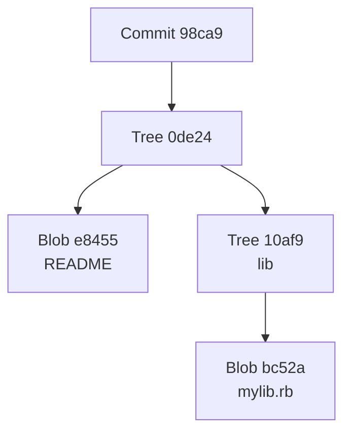

</div>

</div>

---

# Git References

References provide human-readable names to specific points in your commit history

<v-clicks>

## Types of References

- **Branch** - Named reference that moves with new commits
- **Tags** - Immutable references for releases/milestones
- **HEAD** - Special reference to current working directory
- **Remote** - References to branches on remote repositories

</v-clicks>

<v-click>

<div class="mt-4 p-4 bg-blue-50 dark:bg-blue-900 rounded">

💡 **Key Insight**: References allow Git to track where you are and where your code should go

</div>

</v-click>

---

# Branches

A branch is a named reference to a commit

<v-clicks>

- When you make a new commit on a branch, Git moves the branch pointer to the newest commit
- You can have branches that point at different commits
- Enables parallel development workflows

</v-clicks>

<div v-click class="mt-6">
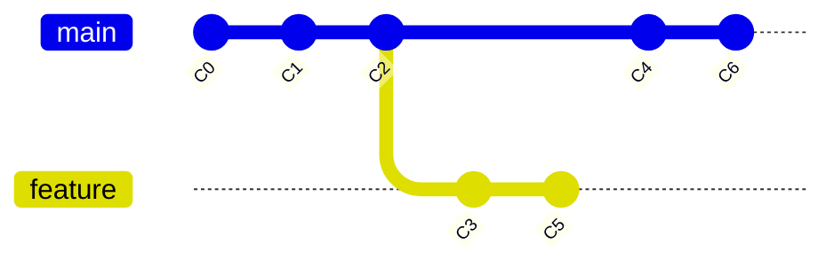

</div>

---

# Branch Types in Development

<v-clicks>

- **Main Branch** - Default branch for production-ready code
- **Feature Branch** - Created to develop new features (e.g., `feature/user-auth`)
- **Bugfix/Hotfix Branches** - For specific issues (e.g., `fix/login-error`, `hotfix/payment-bug`)
- **Release Branches** - Finalize releases before merging (e.g., `release/1.2.0`)
- **Develop Branch** - Merge all features before production

</v-clicks>

---

# Tags

Tags are essentially branches that never move

<v-clicks>

- Used for releases or project milestones
- Mark important points in history
- Typical naming: `v1.0.1`, `v2.3.0-beta`

</v-clicks>

<div v-click class="mt-6">
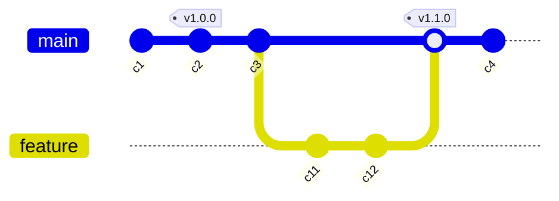

</div>

---

# HEAD Reference

HEAD represents the current working directory or the current branch you're on

<v-clicks>

- Typically HEAD points to `main` or whatever branch you're working on
- **Detached HEAD** state occurs when HEAD points to a commit directly instead of a branch
  - If you make commits in this state, the new commits are orphaned

</v-clicks>

<div v-click class="mt-4">
```
HEAD -> main -> commit abc123
```

</div>

---

# Remote References

Remote references are references to branches on a remote repository (GitHub, GitLab, etc.)

<v-clicks>

- You cannot directly commit to a remote reference
- You must push local branches to update the remote
- Local branches can "track" a remote branch
- Naming convention: `origin/main`, `origin/feature-branch`

</v-clicks>

---

# Remote Workflow Example

<div class="grid grid-cols-1 gap-4">
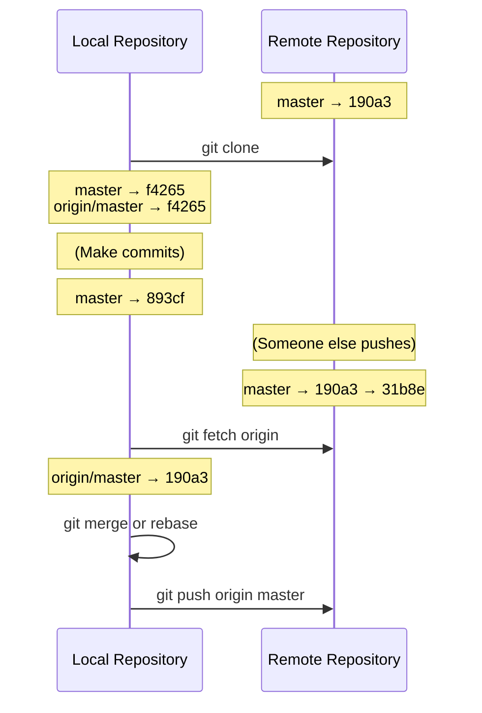

</div>

---

# Git Working Spaces

<div class="grid grid-cols-2 gap-8">

<div>

## Two Main Spaces

- **Repository** - History, metadata, and version database
- **Working Directory** - Where you edit files

</div>

<div>

## File States

- **Untracked** - Files not managed by Git
- **Tracked** files can be:
  - **Unmodified** - Unchanged since last commit
  - **Modified** - Changed but not staged
  - **Staged** - Ready for next commit
  - **Committed** - Safely stored in repository

</div>

</div>

---

# The Staging Area

<div class="text-center mb-4">

The staging area is an intermediate space where changes are prepared before committing

</div>
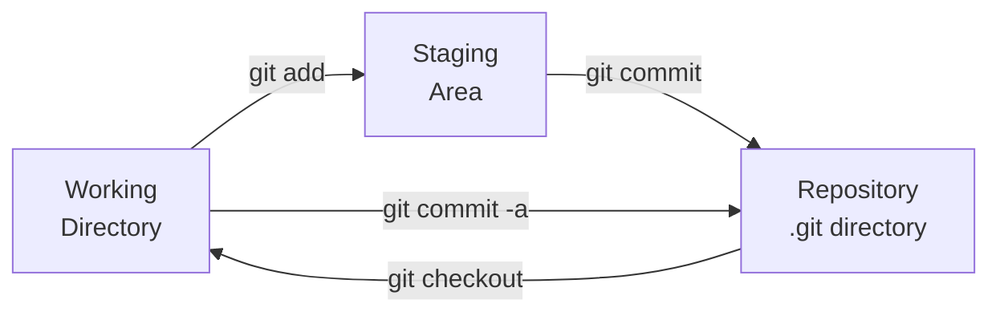

<v-click>

<div class="mt-4 p-4 bg-yellow-50 dark:bg-yellow-900 rounded">

✨ **Staging Area** allows selective commits, acting as a checkpoint before finalizing changes

</div>

</v-click>

---
layout: center
class: text-center
---

# Essential Git Commands

Let's get practical

---

# Git Setup
```bash
# Set your identity
git config --global user.name "Your Name"
git config --global user.email "your.email@example.com"

# Initialize a new repository
git init

# Clone an existing repository
git clone <repository_url>
```

---

# Checking Status & History
```bash
# View current status
git status

# View commit history
git log

# Compact commit history
git log --oneline

# Graphical commit history
git log --graph --oneline --all
```

---

# Staging & Committing
```bash
# Stage specific file
git add <file>

# Stage all changes
git add .

# Commit staged changes
git commit -m "Commit message"

# Modify the last commit
git commit --amend
```

<v-click>

<div class="mt-4 p-4 bg-green-50 dark:bg-green-900 rounded">

💡 **Commit Message Format**: `<type>(<scope>): <message>`

Example: `feat(api): add user authentication`

</div>

</v-click>

---

# Branching Commands
```bash
# List all branches
git branch

# Create a new branch
git branch <branch_name>

# Switch to a branch
git checkout <branch_name>
# or (newer syntax)
git switch <branch_name>

# Create and switch to new branch
git checkout -b <branch_name>
# or
git switch -c <branch_name>

# Delete a branch
git branch -d <branch_name>
```

---

# Remote Repository Commands
```bash
# Link local repository to remote
git remote add origin <repository_url>

# List remote repositories
git remote -v

# Fetch changes from remote
git fetch

# Fetch and merge changes
git pull

# Push changes to remote
git push origin <branch_name>

# Push all branches
git push --all origin
```

---

# Undoing Changes
```bash
# Unstage a file (keep changes)
git reset <file>

# Discard changes in working directory
git checkout -- <file>

# Reset to last commit (removes uncommitted changes)
git reset --hard HEAD

# Create new commit that undoes a specific commit
git revert <commit_hash>

# Reset to specific commit
git reset --hard <commit_hash>
```

<v-click>

<div class="mt-4 p-4 bg-red-50 dark:bg-red-900 rounded">

⚠️ **Warning**: `git reset --hard` permanently discards uncommitted changes

</div>

</v-click>

---

# Tagging
```bash
# Create a tag
git tag <tag_name>

# Create annotated tag with message
git tag -a v1.0.0 -m "Release version 1.0.0"

# List all tags
git tag

# Push specific tag to remote
git push origin <tag_name>

# Push all tags
git push origin --tags
```

---

# Naming Conventions

<div class="grid grid-cols-2 gap-4">

<div>

## Branches
- `feature/<description>`
- `fix/<issue-description>`
- `hotfix/<critical-fix>`
- `release/<version>`
- `develop`
- `main` or `master`

</div>

<div>

## Tags
- `v<major>.<minor>.<patch>`
- `v1.2.3-beta`
- `v1.2.3-rc1`
- `v1.2.3+build20250227`

</div>

</div>

<div class="mt-6">

## Commit Messages
`<type>(<scope>): <message>`

**Types**: `feat`, `fix`, `docs`, `style`, `refactor`, `test`, `chore`

</div>

---
layout: center
class: text-center
---

# Merging Strategies

Combining work from different branches

---

# What is Merging?

<v-clicks>

- Merging combines changes from one branch into another
- Integrates development work from feature branches back into main codebase
- Git automatically determines the best merge strategy
- Three main strategies:
  - Fast-forward merge
  - Three-way (recursive) merge
  - Rebase

</v-clicks>

---

# Fast-Forward Merge

<div class="grid grid-cols-2 gap-4">

<div>

## When It Happens

<v-clicks>

- Target branch has no new commits since feature branch diverged
- Git simply moves the branch pointer forward
- No merge commit created

</v-clicks>

<v-click>

## Pros & Cons

**Pros:**
- Clean, linear history
- Simple and efficient

**Cons:**
- Loses branch context
- Can't be used when main has new commits

</v-click>

</div>

<div>
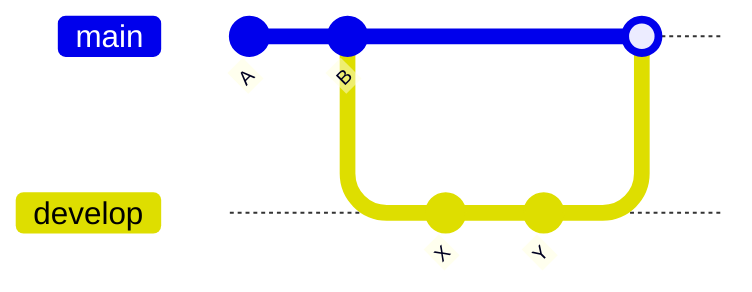

<div v-click class="mt-4">
```bash
# On main branch
git merge develop
# Fast-forward merge applied
```

</div>

</div>

</div>

---

# Three-Way (Recursive) Merge

<div class="grid grid-cols-2 gap-4">

<div>

## When It Happens

<v-clicks>

- Both branches have diverged with unique commits
- Git finds common ancestor
- Compares changes in both branches
- Creates new merge commit

</v-clicks>

<v-click>

## Pros & Cons

**Pros:**
- Preserves branch history
- Works with diverged branches

**Cons:**
- Can cause merge conflicts
- Creates merge commits

</v-click>

</div>

<div>
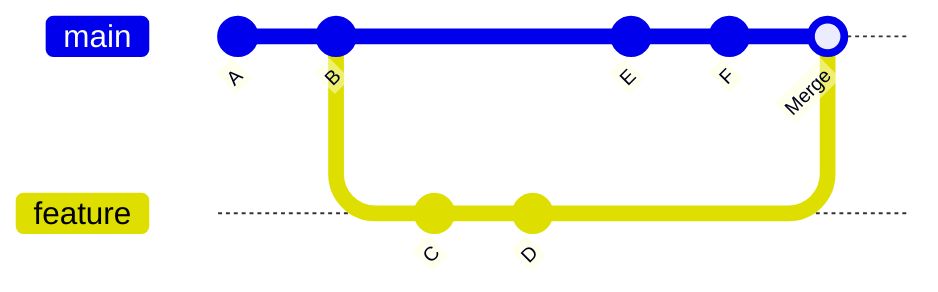

<div v-click class="mt-4">
```bash
git checkout main
git merge feature
# Creates merge commit
```

</div>

</div>

</div>

---

# Rebasing

<div class="grid grid-cols-2 gap-4">

<div>

## How It Works

<v-clicks>

- Reapplies commits from one branch onto another
- Creates a linear history without merge commits
- Rewrites commit history

</v-clicks>

<v-click>

## Pros & Cons

**Pros:**
- Clean, linear history
- No merge commits

**Cons:**
- Rewrites history
- Can disrupt collaborators
- Never rebase public branches!

</v-click>

</div>

<div>
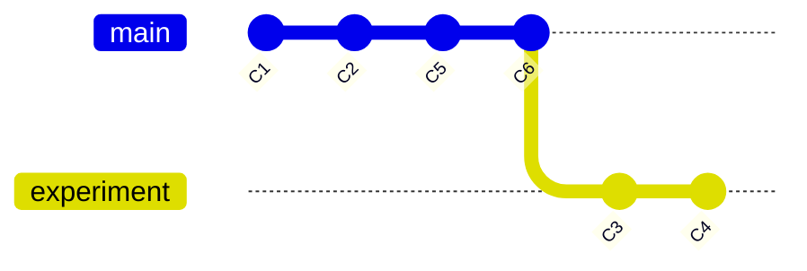

After rebase:
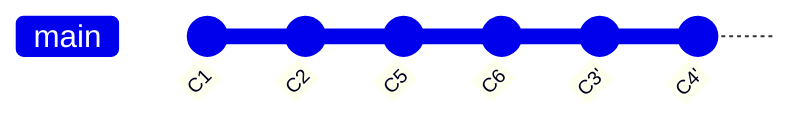

</div>

</div>

---

# Merge Strategy Decision Tree

<v-clicks>

**Fast-Forward Merge:**
- Short-lived feature branches
- No changes on main since branch creation
- Want clean, linear history

**Three-Way Merge:**
- Long-running feature branches
- Multiple developers working simultaneously
- Want to preserve branch history and context

**Rebase:**
- Personal feature branches (not shared)
- Want to clean up commit history before merging
- Preparing for pull request

</v-clicks>

---

# Practice Scenarios

<v-clicks depth="2">

1. **Scenario**: Fix-typo branch, one commit, main unchanged
   - **Strategy**: Fast-forward merge

2. **Scenario**: You and teammate both have unique commits
   - **Strategy**: Three-way merge

3. **Scenario**: Messy experimental commits, want clean history for PR
   - **Strategy**: Rebase (interactive rebase to squash)

4. **Scenario**: Large feature developed over weeks, preserve context
   - **Strategy**: Three-way merge

</v-clicks>

---
layout: center
class: text-center
---

# GitHub Workflows

Collaboration in practice

---

# Pull Requests

<v-clicks>

- Pull Requests (PRs) are a GitHub feature for code review
- Propose changes from your branch to another branch (usually main)
- Team members can:
  - Review code
  - Leave comments
  - Request changes
  - Approve changes
- Once approved, changes can be merged

</v-clicks>

---

# Pull Request Workflow
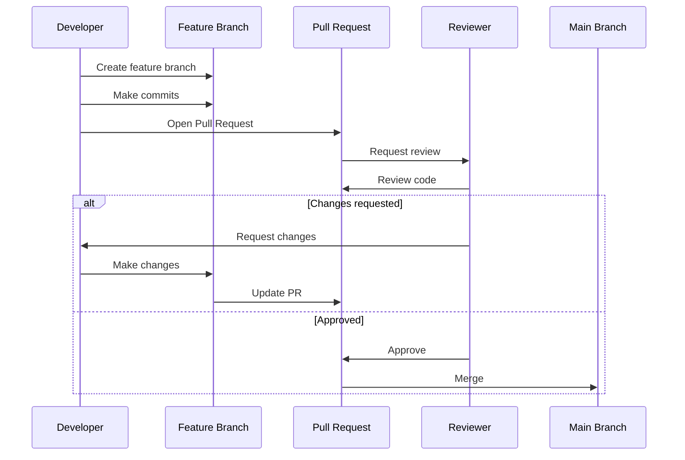

---

# Common Git Situations

<v-clicks depth="2">

- **Removing Sensitive Files**
```bash
  git filter-branch --tree-filter 'rm -f passwords.txt' HEAD
  # Better: use git-filter-repo
```

- **Undoing a Push (Force Push)**
```bash
  git reset --hard HEAD~1
  git push --force origin branch-name
  # ⚠️ Only on personal branches!
```

- **Synchronizing a Fork**
```bash
  git remote add upstream <original-repo-url>
  git fetch upstream
  git merge upstream/main
```

</v-clicks>

---

# More Common Situations

<v-clicks depth="2">

- **Reverting a Commit**
```bash
  git revert <commit-hash>
  # Creates new commit that undoes changes
```

- **Interactive Rebase**
```bash
  git rebase -i HEAD~3
  # Edit, squash, reword, or reorder last 3 commits
```

- **Checking Out File from Another Branch**
```bash
  git checkout other-branch -- path/to/file
```

</v-clicks>

---
layout: center
class: text-center
---

# CI/CD with GitHub Actions

Automate your workflow

---

# Continuous Integration (CI)

<v-clicks>

- Practice of frequently integrating code changes into shared repository
- Code is automatically built and tested with each push
- Goal: Catch issues early, ensure codebase is always deployable

</v-clicks>

<v-click>

## CI Workflow
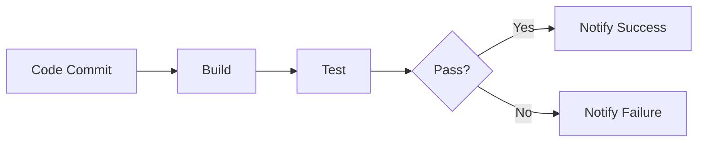

</v-click>

---

# Continuous Deployment (CD)

<v-clicks>

- Ensures code is always in a deployable state
- Actual deployment to production can be manual or automatic
- Goal: Always be ready to deploy with confidence

</v-clicks>

<v-click>

## CD Workflow
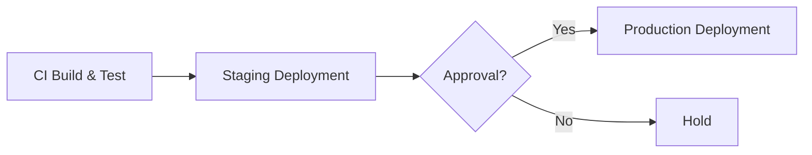

</v-click>

---

# GitHub Actions Overview

<v-clicks>

- Automates workflows in your GitHub repository
- Workflows defined in YAML files (`.github/workflows/`)
- Triggered by GitHub events (push, PR, release, schedule, etc.)
- Workflows contain **jobs** that run **steps**
- Jobs run on different operating systems (Ubuntu, macOS, Windows)
- Steps are either commands or reusable actions

</v-clicks>

---

# Workflow Structure
```yaml
name: My CI Workflow

on:
  push:
    branches: [main]
  pull_request:
    branches: [feature-branch]

jobs:
  build:
    runs-on: ubuntu-latest
    
    steps:
      - name: Checkout code
        uses: actions/checkout@v2
      
      - name: Set up Node.js
        uses: actions/setup-node@v2
        with:
          node-version: '14'
      
      - name: Install dependencies
        run: npm install
      
      - name: Run tests
        run: npm test
```

---

# Workflow Components

<div class="grid grid-cols-2 gap-4">

<div>

## Top Level

<v-clicks>

- **name**: Workflow identifier
- **on**: Trigger events
  - `push`, `pull_request`
  - `workflow_dispatch` (manual)
  - `schedule` (cron)
- **jobs**: Tasks to run

</v-clicks>

</div>

<div>

## Job Level

<v-clicks>

- **runs-on**: Execution environment
- **steps**: Sequence of tasks
- **needs**: Job dependencies
- **env**: Environment variables

</v-clicks>

</div>

</div>

---

# Step Types

<v-clicks>

- **uses**: Run a pre-defined action
```yaml
  - uses: actions/checkout@v2
```

- **run**: Execute shell commands
```yaml
  - run: npm install
```

- **with**: Pass parameters to actions
```yaml
  - uses: actions/setup-node@v2
    with:
      node-version: '14'
```

- **env**: Set environment variables
```yaml
  - run: npm test
    env:
      NODE_ENV: production
```

</v-clicks>

---

# Common GitHub Actions

<v-clicks>

- `actions/checkout@v2` - Check out repository code
- `actions/setup-node@v2` - Set up Node.js environment
- `actions/setup-python@v2` - Set up Python environment
- `actions/cache@v2` - Cache dependencies
- `actions/upload-artifact@v2` - Upload build artifacts
- `actions/download-artifact@v2` - Download artifacts

</v-clicks>

<v-click>

<div class="mt-4 p-4 bg-purple-50 dark:bg-purple-900 rounded">

💡 Browse thousands more at [GitHub Marketplace](https://github.com/marketplace?type=actions)

</div>

</v-click>

---

# Example: Python CI Workflow
```yaml {all|1-2|4-7|9-11|13-31}
name: Python CI

on:
  push:
    branches: [main, develop]
  pull_request:
    branches: [main]

jobs:
  test:
    runs-on: ubuntu-latest

    strategy:
      matrix:
        python-version: [3.8, 3.9, 3.10]

    steps:
      - uses: actions/checkout@v2
      
      - name: Set up Python ${{ matrix.python-version }}
        uses: actions/setup-python@v2
        with:
          python-version: ${{ matrix.python-version }}
      
      - name: Install dependencies
        run: |
          python -m pip install --upgrade pip
          pip install -r requirements.txt
      
      - name: Run tests
        run: pytest
```

---
layout: center
class: text-center
---

# Best Practices

Tips for success

---

# Git Best Practices

<v-clicks>

- **Commit often, commit early** - Small, focused commits
- **Write meaningful commit messages** - Explain why, not just what
- **Use branches for features** - Keep main stable
- **Review code before merging** - Use pull requests
- **Keep commits atomic** - One logical change per commit
- **Don't commit sensitive data** - Use `.gitignore`
- **Pull before you push** - Stay in sync with team
- **Test before committing** - Don't break the build

</v-clicks>

---

# GitHub Workflow Best Practices

<v-clicks>

- **Protect main branch** - Require PR reviews before merge
- **Use descriptive branch names** - Follow naming conventions
- **Keep PRs focused** - Easier to review
- **Review PRs promptly** - Don't block teammates
- **Use draft PRs** - For work in progress
- **Add PR templates** - Standardize information
- **Use issue tracking** - Link PRs to issues
- **Document your code** - README, comments, wikis

</v-clicks>

---

# CI/CD Best Practices

<v-clicks>

- **Run tests on every PR** - Catch issues early
- **Keep builds fast** - Use caching, parallel jobs
- **Fail fast** - Stop on first failure
- **Monitor build status** - Fix broken builds immediately
- **Use matrix builds** - Test multiple environments
- **Separate test and deploy** - Different workflows for different purposes
- **Use secrets for credentials** - Never hardcode passwords
- **Version your workflows** - Keep workflow files in version control

</v-clicks>

---

# Common Pitfalls to Avoid

<v-clicks>

❌ **Committing large files** - Use Git LFS for large assets

❌ **Rewriting public history** - Never rebase shared branches

❌ **Ignoring merge conflicts** - Resolve carefully and test

❌ **Force pushing to main** - Protect your main branch

❌ **Committing sensitive data** - Use environment variables

❌ **Skipping code review** - Always get a second pair of eyes

❌ **Not testing locally** - Test before pushing

</v-clicks>

---
layout: center
class: text-center
---

# Resources & Next Steps

---

# Learning Resources

<div class="grid grid-cols-2 gap-8">

<div>

## Documentation

- [Git Official Docs](https://git-scm.com/doc)
- [GitHub Docs](https://docs.github.com)
- [GitHub Actions Docs](https://docs.github.com/en/actions)
- [Atlassian Git Tutorials](https://www.atlassian.com/git/tutorials)

</div>

<div>

## Interactive Learning

- [Learn Git Branching](https://learngitbranching.js.org/)
- [GitHub Skills](https://skills.github.com/)
- [Git Immersion](http://gitimmersion.com/)
- [Oh My Git!](https://ohmygit.org/) (Game)

</div>

</div>

---

# Tools & Extensions

<v-clicks>

- **Git GUI Clients**
  - GitKraken
  - SourceTree
  - GitHub Desktop
  - VS Code Git integration

- **Command Line Enhancements**
  - Oh My Zsh (with git plugin)
  - Git aliases
  - `tig` (text-mode interface)
  - `lazygit` (terminal UI)

</v-clicks>

---
layout: center
class: text-center
---

# Questions?

Feel free to ask about Git, GitHub, or CI/CD workflows

<div class="mt-8">

### Useful Commands Cheat Sheet

`git status` • `git log --graph` • `git diff` • `git stash`

</div>

---
layout: end
---

# Thank You!

Happy coding with Git! 🚀

<div class="abs-bottom-4 left-4 right-4 text-center text-sm opacity-50">

CMSC398W - Git & GitHub Complete Guide

</div>