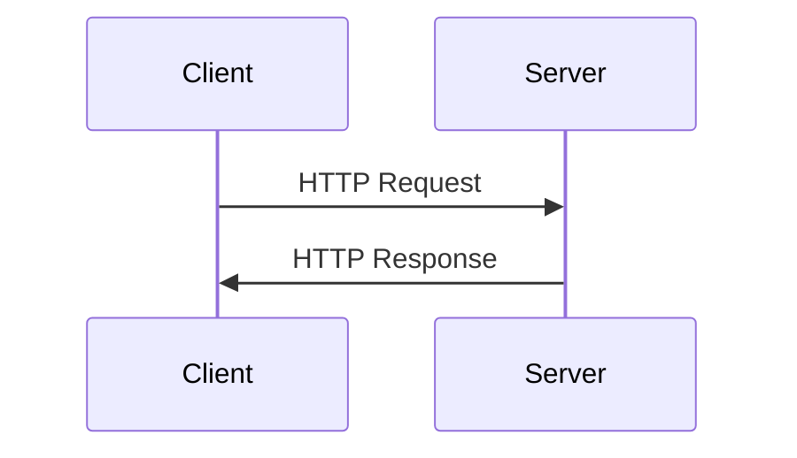

# CMSC398W
# Networking

---

# Review Question

**What is the main difference between a Docker container and a Docker image?**

A) A container requires more storage space than an image  
B) An image is a running instance, while a container is the template  
C) An image is a read-only template, while a container is a running instance of that template  
D) There is no difference between containers and images

<v-click>

**Extended Question:**

You're explaining Docker to a buddy who is familiar with virtual machines. Explain two key advantages of using Docker containers instead of traditional virtual machines, and provide an example scenario where these advantages would be particularly beneficial.

</v-click>

---
layout: section
---

# Networking

---

# Networking and Why

Modern software engineering interacts with networking often:

- Pulling code from GitHub
- Making calls to a third party RESTful API
- Interacting with cloud servers

**Networking problems are hard**

- Significant blocker for development
- Black box model
- CMSC417!

**Goal:** Increase fundamental knowledge alongside tools to help debug

---

# Network Stack / OSI Model

<div class="grid grid-cols-2 gap-8">

<div>

<div class="border-2 border-blue-500 p-2 mb-1 bg-blue-50 dark:bg-blue-900">7 - Application</div>
<div class="border-2 border-blue-500 p-2 mb-1 bg-blue-50 dark:bg-blue-900">6 - Presentation</div>
<div class="border-2 border-blue-500 p-2 mb-1 bg-blue-50 dark:bg-blue-900">5 - Session</div>
<div class="border-2 border-blue-500 p-2 mb-1 bg-blue-50 dark:bg-blue-900">4 - Transport</div>
<div class="border-2 border-green-500 p-2 mb-1 bg-green-50 dark:bg-green-900">3 - Network</div>
<div class="border-2 border-green-500 p-2 mb-1 bg-green-50 dark:bg-green-900">2 - Data Link</div>
<div class="border-2 border-green-500 p-2 mb-1 bg-green-50 dark:bg-green-900">1 - Physical</div>

<div class="text-sm mt-2">
  <span class="text-blue-600 dark:text-blue-400">■</span> Host Layers
  <span class="ml-4 text-green-600 dark:text-green-400">■</span> Media Layers
</div>

</div>

<div>

**Purpose:**

- Helps make sense of the interactions at different steps in a network
- More conceptual than realistic
- Layers 2 through 7 are implemented primarily in software

**Similar model:** TCP/IP

</div>

</div>

---

# Question

You're troubleshooting a network issue where two computers can physically connect to the same network and see each other's MAC addresses, but they cannot establish an IP connection. 

Based on the OSI model, at which layer is the problem most likely occurring?

A) Layer 1 (Physical Layer)  
B) Layer 2 (Data Link Layer)  
C) Layer 3 (Network Layer)  
D) Layer 4 (Transport Layer)

---
layout: section
---

# Addressing and Transport

---

# IP Addressing (Layer 3)

**Internet Protocol (IP) Address**

IP Addresses: unique identifiers used to address interfaces on a global or local network

- **IPv4:** 32 bit number, older, separated into 4 octets (ex. 192.168.1.0)
- **IPv6:** 128 bit number, newer, represented using hexadecimal

**Key Points:**

- IP addresses are not tied to devices, they are tied to **interfaces**
  - What's the difference?
- Can be divided into subnetworks using subnetting
- `127.0.0.1` - The loopback address

---
layout: center
---

# IPv4 vs IPv6

<div class="grid grid-cols-2 gap-8 text-left">

<div>

## IPv4

- 32-bit addresses
- ~4.3 billion addresses
- Dotted decimal notation
- Example: `192.168.1.1`

</div>

<div>

## IPv6

- 128-bit addresses
- ~340 undecillion addresses
- Hexadecimal notation
- Example: `2001:0db8::1`

</div>

</div>

---

# Tool: ip

The `ip addr show` (or `ip a`) command allows you to inspect IP addresses and network interfaces on Linux systems (MacOS needs to install iproute2mac)

```bash
$ ip addr show
1: lo: <LOOPBACK,UP,LOWER_UP> mtu 65536 qdisc noqueue state UNKNOWN group default qlen 1000
    link/loopback 00:00:00:00:00:00 brd 00:00:00:00:00:00
    inet 127.0.0.1/8 scope host lo
       valid_lft forever preferred_lft forever
    inet6 ::1/128 scope host 
       valid_lft forever preferred_lft forever
2: eth0: <BROADCAST,MULTICAST,UP,LOWER_UP> mtu 1500 qdisc fq_codel state UP group default qlen 1000
    link/ether 02:42:ac:11:00:02 brd ff:ff:ff:ff:ff:ff
    inet 172.17.0.2/16 brd 172.17.255.255 scope global eth0
       valid_lft forever preferred_lft forever
    inet6 fe80::42:acff:fe11:2/64 scope link 
       valid_lft forever preferred_lft forever
```

---

# Question

Which of the following is a valid IP address for a home computer on a private network?

A) `127.0.0.1`  
B) `192.168.1.256`  
C) `192.168.1.100`  
D) `256.168.1.1`

---

# Transport (Layer 4)

Provides error checking services and demultiplexing of data packets to the application

<div class="grid grid-cols-2 gap-8">

<div>

## TCP
**Transmission Control Protocol**

- Connection based, reliable delivery service
- Manages data flow to ensure that large chunks are broken up, data is ordered, and lost data gets retransmitted
- Relevant for applications where data integrity matters
- **Examples:** Web browsing, email, file transfers

</div>

<div>

## UDP
**User Datagram Protocol**

- Connectionless, best effort delivery service
- No guarantees about data delivery, order, or duplication
- Relevant for applications where speed matters over data integrity
- **Examples:** Video streaming, online gaming, DNS queries

</div>

</div>

---

# Ports and Sockets

**How do applications distinguish themselves from other services running on the same machine?**

**Port numbers!**

- 16 bit integers (range of 0 to 65535) used to differentiate

**"Well Known" Ports:**

- HTTP on TCP Port 80
- HTTPS on TCP Port 443
- DNS on UDP/TCP Port 53

**Sockets:** Combination of IP address and port form a unique endpoint called a socket

- Example: `172.17.0.2` using TCP on port `443`
- Configuration file: `/etc/services`

---
layout: section
---

# Connectivity Testing

---

# Checking Reachability with ping

Accepts an IP address or hostname and allows you to check basic network reachability

**Steps:**

1. Sends special network packets to a specified destination host
2. If the destination host is reachable, it will reply
3. Receiving these replies confirms that a Layer 3 path exists

```bash
# Ping Google's public DNS server by IP address
$ ping 8.8.8.8 
PING 8.8.8.8 (8.8.8.8) 56(84) bytes of data.
64 bytes from 8.8.8.8: icmp_seq=1 ttl=116 time=12.5 ms
64 bytes from 8.8.8.8: icmp_seq=2 ttl=116 time=12.2 ms
64 bytes from 8.8.8.8: icmp_seq=3 ttl=116 time=13.1 ms
^C  # Press Ctrl+C to stop
--- 8.8.8.8 ping statistics ---
3 packets transmitted, 3 received, 0% packet loss, time 2003ms
rtt min/avg/max/mdev = 12.238/12.616/13.112/0.371 ms
```

---

# Checking Reachability with ping (continued)

```bash
# Ping a hostname (requires DNS to work first)
$ ping google.com
PING google.com (142.250.191.174) 56(84) bytes of data.
64 bytes from lga34s35-in-f14.1e100.net (142.250.191.174): icmp_seq=1 ttl=116 time=11.8 ms
... (Ctrl+C to stop) ...
```

---

# Debugging using ping

**Progressive troubleshooting approach:**

1. `ping 127.0.0.1` (or `ping localhost`): Tests your machine's own network stack. If this fails, there's a fundamental problem with your OS networking setup.

2. `ping <your_own_IP>`: Tests your specific network interface configuration. Should work if step 1 works.

3. `ping <your_gateway_IP>`: Tests connectivity to your local router (the "gateway" connecting your local network to others). Find your gateway using `ip route show | grep default`. Failure here points to a problem on your immediate local network (Wi-Fi, switch, router itself).

4. `ping 8.8.8.8` (or another reliable external IP): Tests basic internet connectivity beyond your local network. If this fails but the gateway ping works, the issue is likely with your router's internet connection or your ISP.
   - Who is 8.8.8.8? (whois)

5. `ping <target_hostname>` (e.g., `ping google.com`): Tests both internet connectivity and basic DNS name resolution. If `ping 8.8.8.8` works but `ping google.com` fails, suspect a DNS problem.

---

# Discovering the Path with traceroute

Traceroute tells you the path that packets take to get to their destination

- Helps to identify where a connection is failing / a delay exists
- Visualization tool: https://stefansundin.github.io/traceroute-mapper/

```bash
$ traceroute google.com 
traceroute to google.com (142.250.191.174), 30 hops max, 60 byte packets
 1  _gateway (192.168.1.1)  0.530 ms  0.480 ms  0.465 ms  # Hop 1: Your local router
 2  10.x.x.x (10.x.x.x)  8.120 ms  8.050 ms  7.995 ms   # Hop 2: ISP Router 1
 3  another-isp-router.net (A.B.C.D)  9.500 ms  9.450 ms  9.400 ms # Hop 3: ISP Router 2
 4  * * *                                                # Hop 4: No reply / Timeout
 5  some-backbone-router.net (E.F.G.H)  15.200 ms  15.150 ms  15.100 ms # Hop 5
 ... (more hops) ...
12  lga34s35-in-f14.1e100.net (142.250.191.174)  11.900 ms  11.850 ms  11.800 ms # Final
```

---

# Understanding DNS (Name Resolution)

<div class="grid grid-cols-2 gap-8">

<div>

**The Problem:**

- IP Addresses are harder to use as humans!

**The Solution:**

- DNS translates domain names to IP addresses
- Uses a DNS resolver to query a name server to get the true IP address of this domain

**Tools:**

- `dig` (Domain Information Groper)
- Alternative: `getent`

</div>

<div>

```bash
# Find the IPv4 address (A record)
$ dig A www.google.com +short 
142.250.191.142

# Find the IPv6 address (AAAA record)
$ dig AAAA www.google.com +short
2607:f8b0:4004:834::200e

# Trace the full recursive lookup path
$ dig +trace www.google.com 
# (Shows queries to root, .com, google.com)

# Query a specific DNS server
$ dig @8.8.8.8 A www.stanford.edu +short
171.67.215.200
```

</div>

</div>

---

# Network Boundaries

<v-clicks>

**Private IPs & NAT**

- Most devices on home, university, or corporate networks use private IP addresses
- Ranges like `10.x.x.x`, `172.16.x.x` to `172.31.x.x`, `192.168.x.x`
- Not routable on the public internet
- Performs Network Address Translation (NAT): translates device IP ↔ single public router IP

**Firewalls**

- Filtering traffic based on defined rules (e.g., blocking incoming connections on specific ports unless explicitly allowed)
- Can exist on your machine, router, or as dedicated appliances / cloud services

**Proxies**

- Intermediary for network requests, traffic goes to the proxy, forwards to the destination
- Uses: caching web content, filtering traffic, enhancing security, or bypassing regional restrictions

</v-clicks>

---

# Securing Communications

**Transmitting plain data is insecure! What do we do about it?**

<v-clicks>

**HTTPS (HTTP Secure)**

- This is standard HTTP layered over with additional encryption
- Encrypted web traffic between your browser and the server
- Uses digital certificates to help verify the server's identity
- What is that padlock icon? 🔒

**VPN (Virtual Private Network)**

- Creates an encrypted "tunnel" between your device and a VPN server
- Protects your data on untrusted networks (like public Wi-Fi)
- Can make your traffic appear to originate from the VPN server's location/IP address

</v-clicks>

---

# Checking Listening Services (ss)

**If you can't connect to a service, why?**

Is it actually running and listening?

Use the `ss` (socket statistics) tool

**Common invocation:** `ss -tulnp`

- `-t`: Show TCP sockets
- `-u`: Show UDP sockets
- `-l`: Show only Listening sockets (sockets waiting for incoming connections)
- `-n`: Show Numeric addresses and ports
- `-p`: Show the Process (program name and PID) that owns the socket

---

# ss Output Example

```bash
$ sudo ss -tulnp
State    Recv-Q   Send-Q     Local Address:Port       Peer Address:Port   Process                                     
LISTEN   0        4096       127.0.0.53%lo:53          0.0.0.0:*          users:(("systemd-resolve",pid=638,fd=13))    
# DNS resolver listening locally

LISTEN   0        128            0.0.0.0:22          0.0.0.0:*          users:(("sshd",pid=870,fd=3))               
# SSH daemon listening on all IPv4 interfaces

LISTEN   0        511            0.0.0.0:80          0.0.0.0:*          users:(("nginx",pid=1234,fd=6))             
# Nginx web server listening on port 80 (IPv4)

LISTEN   0        128               [::]:22             [::]:*          users:(("sshd",pid=870,fd=4))               
# SSH daemon listening on all IPv6 interfaces

LISTEN   0        511               [::]:80             [::]:*          users:(("nginx",pid=1234,fd=7))             
# Nginx web server listening on port 80 (IPv6)
```

---

# HTTP

**HyperText Transfer Protocol**

- Communication protocol for the "World Wide Web"
- Application Layer

**Process:**

<div class="mt-8 text-center">



</div>

---
layout: center
---

# HTTP Request

<div class="text-lg">

```http
GET /index.html HTTP/1.1
Host: www.example.com
User-Agent: Mozilla/5.0
Accept: text/html
Accept-Language: en-US
Connection: keep-alive
```

**Components:**
- Method (GET, POST, PUT, DELETE, etc.)
- Path/Resource
- HTTP Version
- Headers (metadata)
- Body (for POST/PUT)

</div>

---
layout: center
---

# HTTP Response

<div class="text-lg">

```http
HTTP/1.1 200 OK
Date: Mon, 23 May 2023 22:38:34 GMT
Content-Type: text/html; charset=UTF-8
Content-Length: 138
Server: nginx

<html>
  <body>
    <h1>Hello World!</h1>
  </body>
</html>
```

**Components:**
- HTTP Version
- Status Code
- Status Message
- Headers
- Body (content)

</div>

---
layout: center
---

# HTTP Status Codes

<div class="grid grid-cols-2 gap-8">

<div>

**1xx - Informational**
- 100 Continue

**2xx - Success**
- 200 OK
- 201 Created
- 204 No Content

**3xx - Redirection**
- 301 Moved Permanently
- 302 Found
- 304 Not Modified

</div>

<div>

**4xx - Client Error**
- 400 Bad Request
- 401 Unauthorized
- 403 Forbidden
- 404 Not Found

**5xx - Server Error**
- 500 Internal Server Error
- 502 Bad Gateway
- 503 Service Unavailable

</div>

</div>

---

# Talking Directly to Web Services (curl)

**curl:** tool for transferring data over various network protocols

- Commonly used to interact with web services, download files, etc. while interacting with protocols like HTTP
- Enables diagnosis of application level issues
- Similar to the `wget` tool, see comparison: https://daniel.haxx.se/docs/curl-vs-wget.html

**Basic syntax:**
```bash
curl [options] [URL]
```

**`curl -v` is useful because it tells you:**

- If the DNS resolution succeeded (`Trying ...`)
- If the TCP connection was established (`Connected to ...`)
- If the TLS handshake (for HTTPS) completed successfully (`SSL connection using ...`)
- The exact HTTP request headers curl sent (`>`)
- The HTTP status code and response headers received from the server (`<`) (e.g., 200 OK, 404 Not Found, 500 Internal Server Error)
- The response body (unless using `-I`)

---
layout: end
---

# Thank You!

Questions?